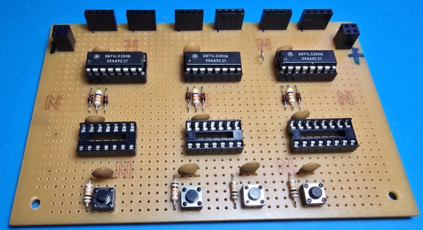

###  การประกอบวงจร 

วงจร controller  เป็นส่วนที่สำคัญมากในโครงงานนี้ เพราะเป็นส่วนที่ทำหน้าที่ควบคุมการทำงานของวงจรนับเวลา (Counter) และส่งสัญญาณไปยังส่วนแสดงผล (Display) เพื่อให้สามารถแสดงผลตัวเลขได้อย่างถูกต้องและสวยงาม ดังนั้น การประกอบวงจร controller จึงต้องทำอย่างระมัดระวังและมีความละเอียดสูง เพื่อให้แน่ใจว่าวงจรจะทำงานได้อย่างถูกต้องและไม่มีปัญหาในการใช้งานในภายหลัง

#### วงจร controller ประกอบด้วยส่วนหลัก ๆ ดังนี้
- ส่วนสร้างสัญญาณ Clock ซึ่งจะใช้ไอซี 555 ในการสร้างสัญญาณ Clock ที่มีความถี่ 1Hz เพื่อให้สามารถนับเวลาได้
- ส่วนควบคุมเส้นทางของสัญญาณ Clock ซึ่งจะใช้ไอซี 74157 เป็นตัวเลือกในการส่งสัญญาณ Clock ไปยังวงจรนับเวลา (Counter) หรือจะส่งสัญญาณจากการกดปุ่มเพื่อตั้งเวลาไปยังวงจรนับเวลา (Counter) แทน
- วงจรนี้จะมีส่วนแสดงผลด้วย LED สองดวงคือ LED สีแดงที่จะแสดงสถานะการทำงานของสัญญาณ Clock และ LED สีเขียวที่จะแสดงสถานะการทำงานของปุ่มตั้งเวลา
  - โดย LED สีแดงจะกระพริบตามสัญญาณ Clock และไม่สนใจวงจรส่วนอื่น ๆ ในระบบ
  - ส่วน LED สีเขียวจะติดเมื่อมีการกดปุ่มตั้งเวลา และจะดับเมื่อกดปุ่มตั้งเวลาอีกครั้ง โดยความร่วมมือจาก D-FF เบอร์ 7474 นั่นเอง ถ้า LED สีเขียวติดอยู่ แสดงว่าโหมดตั้งเวลาทำงานอยู่ และถ้า LED สีเขียวดับ แสดงว่าโหมดนาฬิกากำลังทำงานอยู่

