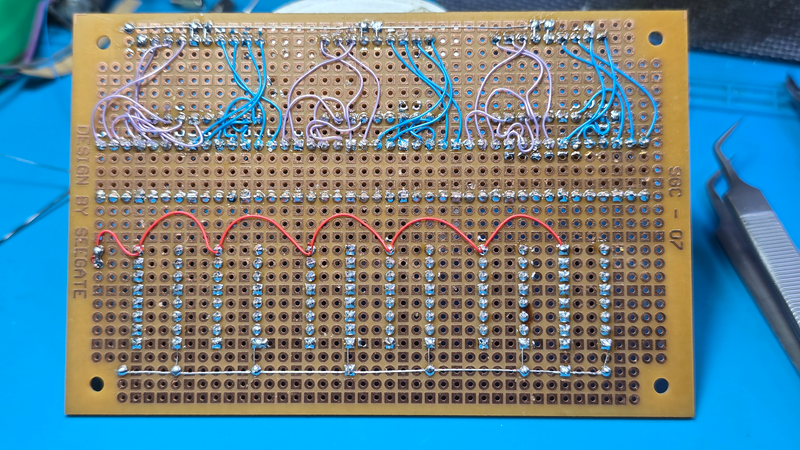

## ขั้นตอนการประกอบวงจรและข้อควรระวัง
### การบัดกรี 7-Segment

7 segment เป็นส่วนที่สำคัญที่สุดของโครงงานนี้ เพราะเป็นส่วนที่แสดงผลตัวเลขออกมาให้เราเห็น ดังนั้นการบัดกรี 7-Segment จึงต้องระมัดระวังเป็นพิเศษ เพื่อให้ได้ผลลัพธ์ที่ดีและลดความเสี่ยงในการทำพัง เราจะไม่บัดกรี 7-Segment ลงบนแผ่นผรินท์โดยตรง แต่จะใช้ขั้วต่อ (Connector) เพื่อเสียบแทนการบัดกรี ซึ่งจะช่วยให้เราสามารถถอดและเสียบ 7-Segment ได้ง่ายขึ้นในกรณีที่ทำพัง หรือถ้าต้องการเปลี่ยน 7-Segment ใหม่

### การบัดกรีไอซี

การบัดกรีไอซีก็เช่นเดียวกันกับ 7-Segment เราจะไม่บัดกรีไอซีลงบนแผ่นพิมพ์โดยตรง แต่จะใช้ขั้วต่อ (Socket) เพื่อเสียบแทนการบัดกรี ซึ่งจะช่วยให้เราสามารถถอดและเสียบไอซีได้ง่ายขึ้นในกรณีที่ทำพัง หรือถ้าต้องการเปลี่ยนไอซีใหม่

### การวางตำแหน่งอุปกรณ์ส่วนแสดงผล

การวางตำแหน่งอุปกรณ์ส่วนแสดงผล (Display) ควรจะวางไว้ในตำแหน่งที่เหมาะสม เพื่อให้สามารถมองเห็นได้ชัดเจน และไม่ถูกบังด้วยอุปกรณ์อื่น ๆ ในวงจร นอกจากนี้ยังควรจะวางไว้ในตำแหน่งที่สะดวกในการเชื่อมต่อกับส่วนอื่น ๆ ของวงจร เช่น Counter และ Controller เพื่อให้การเดินสายและการเชื่อมต่อเป็นไปอย่างง่ายดายและไม่ซับซ้อน

จากรูป เป็นตัวอย่างการวางตำแหน่งอุปกรณ์ส่วนแสดงผล (Display) ที่สะดวกต่อการเชื่อมต่อกับส่วนอื่น ๆ ของวงจร และสามารถมองเห็นได้ชัดเจน นักศึกษาสามารถปรับเปลี่ยนตำแหน่งได้ตามความสะดวกและความถนัดในการประกอบวงจรของแต่ละคน

ที่เห็นตัวต้านทานวางเรียบ ๆ กันอยู่ในรูป เป็นเพราะเราพับขามันไว้ หลังจากที่เสียบลงบนบอร์ด เพื่อไม่ให้มันหลุดออกมา และเราจะดัดขาให้มันตั้งขึ้นมาในขั้นตอนการบัดกรี   

### การบัดกรีอุปกรณ์ที่วางไว้ในตำแหน่งที่เหมาะสมแล้ว

จากรูป เป็นตัวอย่างการบัดกรีอุปกรณ์ที่วางไว้ในตำแหน่งที่เหมาะสมแล้ว ซึ่งจะช่วยให้การบัดกรีเป็นไปอย่างง่ายดายและไม่ซับซ้อน นักศึกษาควรจะบัดกรีอย่างระมัดระวัง และตรวจสอบการเชื่อมต่อหลังจากที่บัดกรีเสร็จแล้ว เพื่อให้แน่ใจว่าไม่มีการเชื่อมต่อผิดพลาดหรือขาดหายไป

เมื่อบัดกรี socket กับ connector รวมถึงตัวต้านทานเสร็จแล้ว ต่อไปเราก็จะเริ่ม wiring สายกัน
ถ้าให้ดีนักศึกษาควรจะหาสาย wiring ไว้หลาย ๆ สีและจัดหมวดหมู่ตามสีที่เหมาะสม
เช่น 
- สายสีแดงจะแทน power supply
- สายสีดำ แทนกราวด์
- สายสีเขียวอาจจะเป็นสัญญาณ seven segment ก่อนผ่านตัวต้านทาน
- สายสีฟ้าเป็นสายจากตัวต้านทานไปยัง seven segment เป็นต้น 
ทั้งนี้ ก็เพื่อให้การ wiring สายเป็นไปอย่างง่ายดายและไม่ซับซ้อน

เมื่อบัดกรีเสร็จแล้ว ให้ทำการตรวจสอบให้ถูกต้องครบถ้วน

เพื่อให้การตรวจสอบได้ผลดี นักศึกษาควรจะแบ่งหน้าที่กันตรวจสอบ โดยการให้คนที่ไม่ได้บัดกรีเป็นคนตรวจสอบ
เพราะจะได้ไม่เข้าข้างตัวเองว่าบัดดีครบถ้วนดีแล้ว

## การทดสอบวงจรที่บัดกรีเสร็จแล้ว

ขั้นตอนถัดไปคือเราจะต้องทดสอบบอร์ดที่เราบัดกรีแล้วโดยการทดสอบทีละส่วน โดยยังไม่ต้องเสียบไอซีหรือ 7-Segment ลงไปใน socket หรือ connector การทดสอบนี้ ควรทดสอบ 100% ของจุดเชื่อมต่อทั้งหมด

วิธีการทดสอบที่แนะนำคือการใช้มัลติมิเตอร์วัดความต่อเนื่องของสัญญาณตามจุดที่เชื่อมต่อกันตามวงจร (Continuity Test) เพื่อให้แน่ใจว่าไม่มีการเชื่อมต่อผิดพลาดหรือขาดหายไป และเพื่อให้แน่ใจว่าไม่มีการช็อตกันของสัญญาณที่ไม่ควรจะเชื่อมต่อกัน

ข้อผิดพลาดที่ร้ายแรงที่สุดคือการเชื่อมต่อสายไฟผิดพลาด ที่ทำให้ไฟเลี้ยง (Power Supply) ไปเชื่อมต่อกับกราวด์ (Ground) 
ถ้าเราต่อไฟเลี้ยงมาจากพอร์ต USB ของคอมพิวเตอร์แล้วเกิดการช็อตกันแบบนี้ อาจจะทำให้คอมพิวเตอร์ของเราพังได้เลย ดังนั้นการตรวจสอบความต่อเนื่องของสัญญาณจึงเป็นสิ่งที่สำคัญมาก ๆ ในขั้นตอนนี้

จุดที่สำคัญลำดับต่อมาคือ แต่ละเซกเมนต์ของ 7-Segment ต้องมีการเชื่อมต่อกับตัวต้านทานที่ถูกต้อง และตัวต้านทานต้องเชื่อมต่อกับขาออกของไอซีถอดรหัส BCD เป็น 7-Segment อย่างถูกต้องด้วยเช่นกัน 
ถ้าหากมีการเชื่อมต่อผิดพลาดในจุดนี้ อาจจะทำให้ 7-Segment แสดงผลผิดพลาด หรือไม่แสดงผลเลยก็ได้ ดังนั้นการตรวจสอบความต่อเนื่องของสัญญาณในจุดนี้จึงเป็นสิ่งที่สำคัญมาก ๆ เช่นกัน

