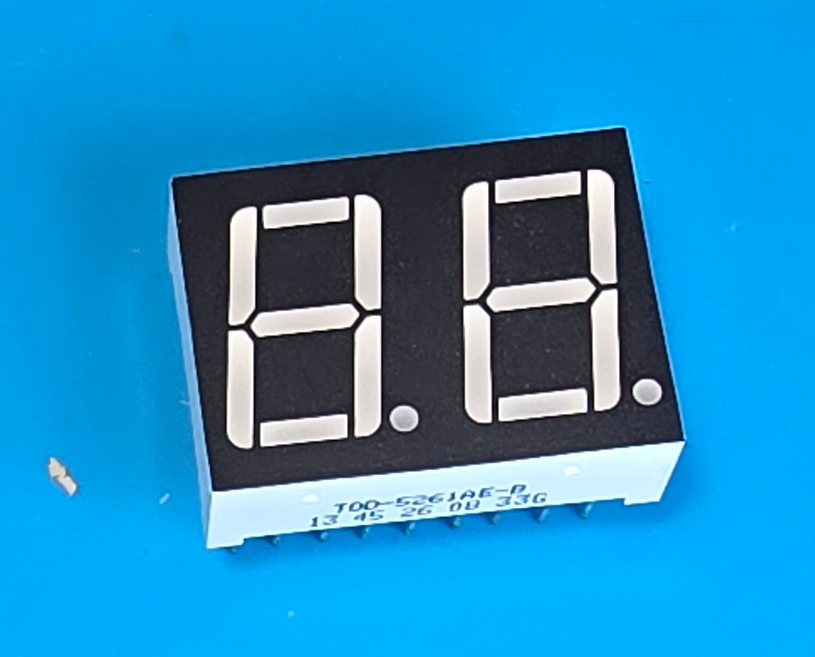
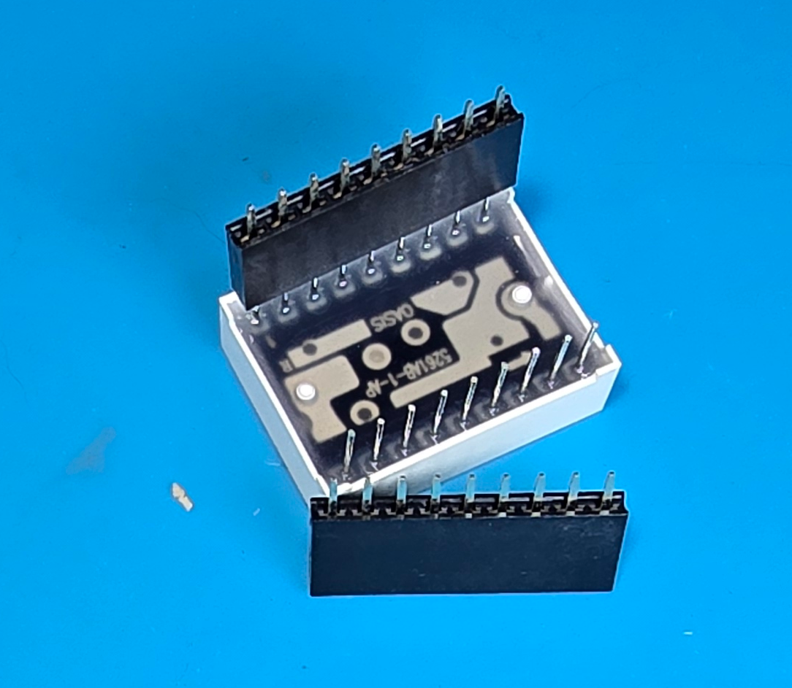
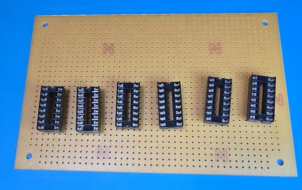
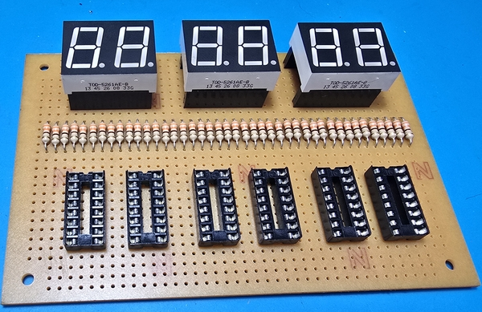
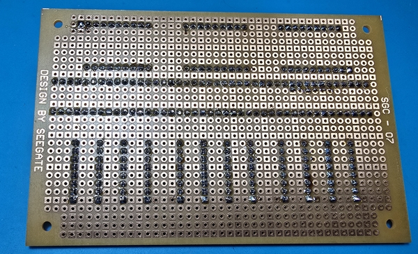

## ขั้นตอนการประกอบวงจรและข้อควรระวัง
### การบัดกรี 7-Segment

7 segment เป็นส่วนที่สำคัญที่สุดของโครงงานนี้ เพราะเป็นส่วนที่แสดงผลตัวเลขออกมาให้เราเห็น ดังนั้นการบัดกรี 7-Segment จึงต้องระมัดระวังเป็นพิเศษ เพื่อให้ได้ผลลัพธ์ที่ดีและลดความเสี่ยงในการทำพัง เราจะไม่บัดกรี 7-Segment ลงบนแผ่นผรินท์โดยตรง แต่จะใช้ขั้วต่อ (Connector) เพื่อเสียบแทนการบัดกรี ซึ่งจะช่วยให้เราสามารถถอดและเสียบ 7-Segment ได้ง่ายขึ้นในกรณีที่ทำพัง หรือถ้าต้องการเปลี่ยน 7-Segment ใหม่

### การบัดกรีไอซี

การบัดกรีไอซีก็เช่นเดียวกันกับ 7-Segment เราจะไม่บัดกรีไอซีลงบนแผ่นพิมพ์โดยตรง แต่จะใช้ขั้วต่อ (Socket) เพื่อเสียบแทนการบัดกรี ซึ่งจะช่วยให้เราสามารถถอดและเสียบไอซีได้ง่ายขึ้นในกรณีที่ทำพัง หรือถ้าต้องการเปลี่ยนไอซีใหม่

### การวางตำแหน่งอุปกรณ์ส่วนแสดงผล

การวางตำแหน่งอุปกรณ์ส่วนแสดงผล (Display) ควรจะวางไว้ในตำแหน่งที่เหมาะสม เพื่อให้สามารถมองเห็นได้ชัดเจน และไม่ถูกบังด้วยอุปกรณ์อื่น ๆ ในวงจร นอกจากนี้ยังควรจะวางไว้ในตำแหน่งที่สะดวกในการเชื่อมต่อกับส่วนอื่น ๆ ของวงจร เช่น Counter และ Controller เพื่อให้การเดินสายและการเชื่อมต่อเป็นไปอย่างง่ายดายและไม่ซับซ้อน

จากรูป เป็นตัวอย่างการวางตำแหน่งอุปกรณ์ส่วนแสดงผล (Display) ที่สะดวกต่อการเชื่อมต่อกับส่วนอื่น ๆ ของวงจร และสามารถมองเห็นได้ชัดเจนครับ นักศึกษาสามารถปรับเปลี่ยนตำแหน่งได้ตามความสะดวกและความถนัดในการประกอบวงจรของแต่ละคนครับ

ที่เห็นตัวต้านทานวางเรียบ ๆ กันอยู่ในรูป เป็นเพราะเราพับขามันไว้ หลังจากที่เสียบลงบนบอร์ด เพื่อไม่ให้มันหลุดออกมา และเราจะดัดขาให้มันตั้งขึ้นมาในขั้นตอนการบัดกรีครับ   

### การบัดกรีอุปกรณ์ที่วางไว้ในตำแหน่งที่เหมาะสมแล้ว

จากรูป เป็นตัวอย่างการบัดกรีอุปกรณ์ที่วางไว้ในตำแหน่งที่เหมาะสมแล้ว ซึ่งจะช่วยให้การบัดกรีเป็นไปอย่างง่ายดายและไม่ซับซ้อนครับ นักศึกษาควรจะบัดกรีอย่างระมัดระวัง และตรวจสอบการเชื่อมต่อหลังจากที่บัดกรีเสร็จแล้ว เพื่อให้แน่ใจว่าไม่มีการเชื่อมต่อผิดพลาดหรือขาดหายไปครับ

