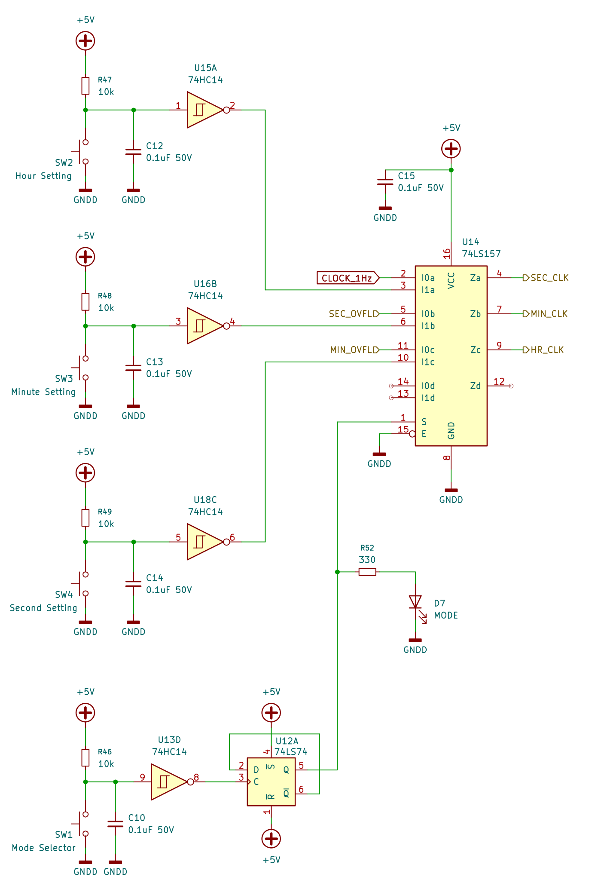
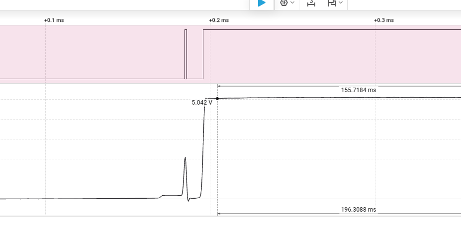
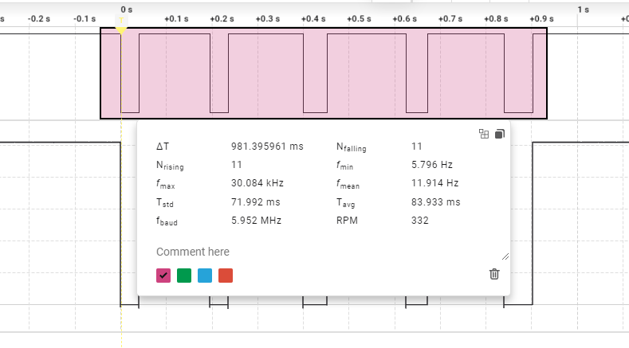
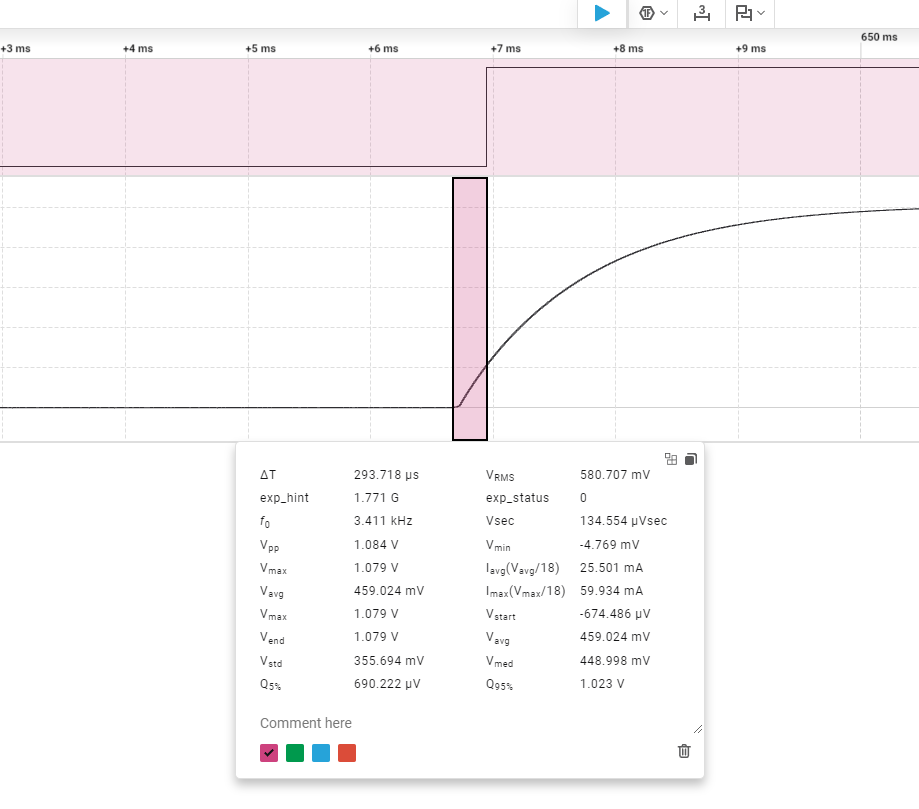
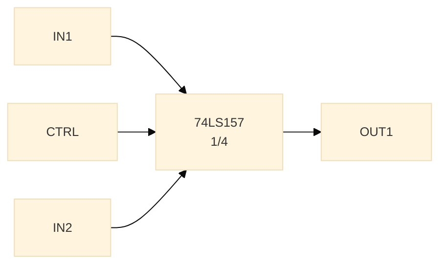
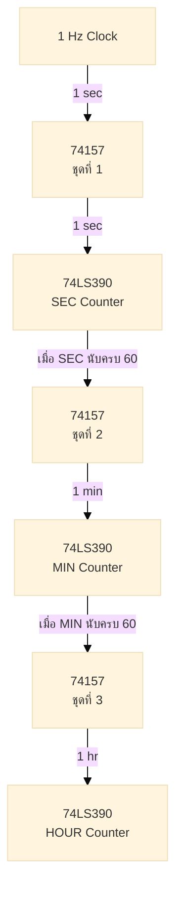
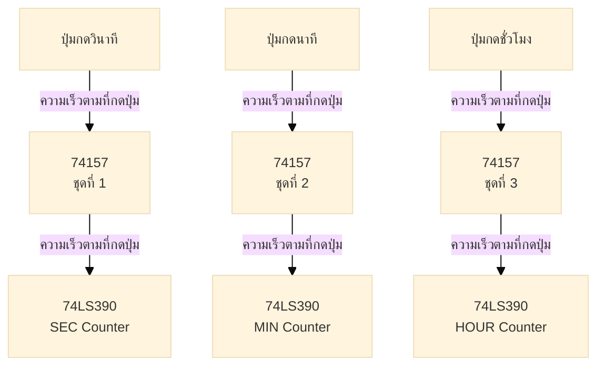

# ส่วนตวบคุมการทำงานและตั้งเวลา (Controller and Time Setting)

เนื้อหาในส่วนนี้จะอธิบายเกี่ยวกับวงจรตั้งเวลา (Time Setting Circuit) ซึ่งเป็นส่วนที่สำคัญมากในโครงงานนี้ เพราะเป็นส่วนที่ทำหน้าที่ให้ผู้ใช้งานสามารถตั้งค่าเวลา (ชั่วโมง นาที วินาที) ได้อย่างง่ายดายและสะดวกสบาย โดยไม่ต้องไปแก้ไขวงจรนับเวลา (Counter) หรือส่วนแสดงผล (Display) แต่อย่างใด

 <b>รูปที่ 1</b> วงจรรวมของระบบควบคุมและตั้งเวลา 

วงจรตั้งเวลานี้จะประกอบด้วยส่วนหลัก ๆ ดังนี้

### 1. ปุ่มกด (Push Button) เลือกโหมดการทำงาน

ปุ่มกดเลือกโหมดการทำงาน ใช้เพื่อกำหนดให้นาฬิกาของเราเดินตามปกติหรือตั้งเวลาได้ ปุ่มกดนี้จะไปควบคุมการทำงานของ D-FF 74LS74 ที่ใช้ในการควบคุมโหมดการทำงานของวงจรตั้งเวลา (Time Setting Circuit) โดยจะทำหน้าที่เป็น toggle switch แบบสัมผัสด้วยการกดปุ่มเดียว ซึ่งจะช่วยให้ผู้ใช้งานสามารถสลับโหมดการทำงานได้อย่างง่ายดายและสะดวกสบาย โดยไม่ต้องไปแก้ไขวงจรนับเวลา (Counter) หรือส่วนแสดงผล (Display) แต่อย่างใด

แต่การต่อวงจรง่าย ๆ กลับส่งผลให้มีปัญหาที่เกิดขึ้น นั่นคือสัญญาณจากปุ่มกดจะมีการสั่นไหว (Bounce) ซึ่งอาจจะเกิดจากหน้าสัมผัสทางแมคานิกส์ของสวิตช์ไม่เป็นไปตามอุดมคติ พิจารณารูปที่ 2

 <b>รูปที่ 2</b> สัญญาณจากปุ่มกดที่ไม่มีวงจร Debounce จะมีการสั่นไหว (Bounce)

จากรูปที่ 2 จะเห็นว่าสัญญาณจากปุ่มกดที่ไม่มีวงจร Debounce จะมีการสั่นไหว (Bounce) ซึ่งอาจจะทำให้เกิดการตั้งค่าเวลาที่ผิดเพี้ยนได้ จากการทดลองกด Switch ที่ไม่มีวงจร debounce ติดกัน 5 ครั้ง  พบว่าในบางจังหวะ มีเอาต์พุตออกมาจาก switch มากถึง 11 ครั้ง ซึ่งจะทำให้เกิดการตั้งค่าเวลาที่ไม่ถูกต้องได้ 

 <b>รูปที่ 3</b> สัญญาณจากปุ่มกดที่ไม่มีวงจร Debounce ติดกัน 5 ครั้ง จะมีการสั่นไหว (Bounce) ทำให้มีเอาต์พุตออกมาจาก switch มากถึง 11 ครั้ง

จากปัญหาในรูปที่ 3 เราจึงต้องมีวงจร Debounce เพื่อช่วยให้สัญญาณจากปุ่มกดมีความเสถียรและไม่เกิดการสั่นไหว (Bounce) โดยการใส่ตัวเก็บประจุ (Capacitor) ร่วมกับตัวต้านทาน (Resistor) เพื่อกรองสัญญาณจากปุ่มกดให้มีความเสถียรและไม่เกิดการสั่นไหวได้อย่างมีประสิทธิภาพ 

วงจร Debounce นี้จะเป็นวงจร RC ที่ประกอบด้วยตัวต้านทานและตัวเก็บประจุ โดยมีค่า  $R = 10kΩ$ และ $C = 100nF$ ซึ่งจะช่วยให้สัญญาณจากปุ่มกดไม่เกิดการสั่นไหวที่จะทำให้เกิดการผิดเพี้ยนในการนับเลขได้ 

จากที่ได้เรียนวงจรไฟฟ้า พบว่าค่า time constant ของวงจร RC จะเท่ากับ $R \times C$ ซึ่งในกรณีนี้จะเท่ากับ $10kΩ \times 100nF = 1ms$ ซึ่งเป็นค่าที่เหมาะสมสำหรับการกรองสัญญาณจากปุ่มกดให้มีความเสถียรและไม่เกิดการสั่นไหวได้อย่างมีประสิทธิภาพ

ปัญหาที่ตามมาจากการใส่ RC Debounce นี้คือจะทำให้ D-FF ที่ใช้ในการควบคุมโหมดการทำงานของวงจรตั้งเวลา (Time Setting Circuit) ไม่สามารถทำงานได้อย่างถูกต้องและมีความเสถียร เนื่องจากเวลาไต่ขึ้นของสัญญาณจากปุ่มกดที่ผ่านวงจร Debounce จะมีความช้าและไม่คม ทำให้ D-FF ไม่สามารถทำงานได้อย่างถูกต้อง 

 <b>รูปที่ 4</b> เวลาไต่ขึ้นของสัญญาณจากปุ่มกดที่ผ่านวงจร Debounce จะมีความช้าและไม่คม ทำให้ D-FF ไม่สามารถทำงานได้อย่างถูกต้อง

จากปัญหาในรูปที่ 4 เราจึงได้แก้ไขโดยการเพิ่มไอซี 74LS14 ซึ่งเป็น Schmitt Trigger Inverter เพื่อช่วยให้สัญญาณจากปุ่มที่ผ่านวงจร Debounce มีความคมมากพอที่จะทำให้ D-FF สามารถทำงานได้อย่างถูกต้องและมีความเสถียรมากขึ้น 

จากการทดลองใช้งานจริง พบว่าวงจร Debounce ที่มี Schmitt Trigger Inverter นี้สามารถกรองสัญญาณจากปุ่มกดได้อย่างมีประสิทธิภาพและทำให้ D-FF สามารถทำงานได้อย่างถูกต้องและมีความเสถียรมากขึ้น โดยไม่มีการเกิดการตั้งค่าเวลาที่ผิดเพี้ยนจากการกดปุ่มกดอีกต่อไปแล้ว สังเกตุได้จากการทดลองกด Switch ที่มีวงจร debounce ติดกัน 5 ครั้ง พบว่าในทุกจังหวะ มีเอาต์พุตออกมาจาก switch เพียงแค่ 5 ครั้งเท่านั้น แทนที่จะ มากถึง 11 ครั้งเหมือนในกรณีที่ไม่มีวงจร debounce ซึ่งแสดงให้เห็นว่าวงจร Debounce ที่มี Schmitt Trigger Inverter นี้สามารถกรองสัญญาณจากปุ่มกดได้อย่างมีประสิทธิภาพและทำให้ D-FF สามารถทำงานได้อย่างถูกต้องและมีความเสถียรมากขึ้น ดังรูปที่ 5 

 <b>รูปที่ 5</b> วงจร Debounce ที่มี Schmitt Trigger Inverter สามารถกรองสัญญาณจากปุ่มกดได้อย่างมีประสิทธิภาพและทำให้ D-FF สามารถทำงานได้อย่างถูกต้องและมีความเสถียรมากขึ้น

ความโชคดีประการหนึ่งที่เราเจอจากวงจรนี้ คือเราสามารถใช้เอาต์พุตจาก Schmitt Trigger Inverter นี้ไปควบคุมการทำงานของ D-FF ได้เลย โดยไม่ต้องเพิ่มวงจร Inverter เพิ่มเติมอีกวงหนึ่ง ซึ่งจะช่วยให้การออกแบบวงจรตั้งเวลา (Time Setting Circuit) มีความเรียบง่ายและซับซ้อนน้อยลง ซึ่งเอาต์พุตจาก D-FF จะถูกส่งไปยังวงจรควบคุม (Controller) เพื่อให้สามารถสลับโหมดการทำงานระหว่างโหมดนาฬิกาและโหมดตั้งเวลา 

เหตุผลที่เราเลือกใช้ D-FF ในการควบคุมโหมดการทำงานของวงจรตั้งเวลา (Time Setting Circuit) แทนสวิตช์เลือกแบบแมคานิกส์เพราะ D-FF เป็นไอซีที่มีความเสถียรและสามารถเก็บสถานะได้อย่างแม่นยำ เมื่อใช้ไปนาน ๆ สวิตช์เลือกแบบแมคานิกส์อาจจะเกิดการสึกหรอหรือเสียหาย ทำให้เกิดการสลับโหมดไปมาโดยไม่ตั้งใจ การใช้ D-FF สามารถช่วยให้เราเลือกโหมดทำงานแบบอิเล็กทรอนิกส์ นั่นหมายความว่าเราอาจจะใช้รีโมทคอนโทรลหรือสัญญาณจากไมโครคอนโทรลเลอร์ในการควบคุมโหมดการทำงานของวงจรตั้งเวลา (Time Setting Circuit) ได้ในอนาคต ซึ่งจะช่วยเพิ่มความสะดวกสบายและความยืดหยุ่นในการใช้งานได้มากขึ้นอีกด้วย

โหมดการทำงาน จะแสดงด้วย LED สีเขียวถ้า LED สีเขียวดับ หมายถึงวงจรอยู่ในโหมดนาฬิกา โดยจะรับ clock จาก NE555 แต่ถ้า LED สีเขียวติดอยู่ หมายถึงวงจรอยู่ในโหมดตั้งเวลา โดยจะรับ clock จากการกดปุ่มตั้งเวลาแทน ซึ่งจะทำให้ผู้ใช้งานสามารถตั้งค่าเวลาได้

### 2. ปุ่มกด (Push Button) เลือกตั้งเวลา (ในโหมด Time Setting)

ปุ่มกดอีก 3 ปุ่มที่เหลือ ใช้เพื่อกำหนดให้สามารถตั้งค่าเวลา (ชั่วโมง นาที วินาที) โดยปุ่มกดทั้งสามนี้ จะทำงานร่วมกับวงจรควบคุม (Controller) เพื่อส่งสัญญาณไปยังวงจรนับเวลา (Counter) ที่แยกจากกันโดยอิสระโดยไอซี 741LS57 (อธิบายในหัวข้อถัดไป) เพื่อให้สามารถตั้งค่าเวลาได้อย่างถูกต้องและง่ายดาย โดยปุ่มกดแต่ละปุ่มจะมีหน้าที่ดังนี้

ปุ่มกดทั้งสามนี้จะมีวงจร Debounce และ Schmitt Trigger Inverter เหมือนกับปุ่มกดเลือกโหมดการทำงาน ต่างกันตรงที่จะใมีการต่อตัวต้านทานแบบ pull-down เพื่อให้ได้เอาต์พุของ schmitt trigger inverter เป็น 0V เมื่อไม่มีการกดปุ่ม และจะได้เอาต์พุตเป็น 5V เมื่อมีการกดปุ่ม ซึ่งจะช่วยให้การส่งสัญญาณไปยังวงจรนับ (Counter) ทำให้มีการนับขึ้นตอนกดสวิตช์ไม่ใช่ตอนปล่อยสวิตช์เหมือนกับปุ่มกดเลือกโหมดการทำงาน ซึ่งจะช่วยให้การตั้งค่าเวลาเป็นไปตามความรู้สึกของผู้ใช้งานมากขึ้น  

#### การทำงานที่ออกแบบไว้

การทำงานที่คาดหวังของวงจรควบคุม เป็นไปตามตารางที่ 1

ตารางที่ 1 เงื่อนไขการทำงานของปุ่มกด

| อุปกรณ์        | โหมดตั้งเวลา                           | โหมดนาฬิกา               |
| -------------- | -------------------------------------- | ------------------------ |
| LED สีเขียว    | ติดเมื่ออยู่ในโหมดตั้งเวลา             | ดับเมื่ออยู่ในโหมดนาฬิกา |
| ปุ่มกดที่หนึ่ง | ส่งผ่าน  74LS157 ไปยัง counter ชั่วโมง | ไม่ส่งผลต่อการทำงาน      |
| ปุ่มกดที่สอง   | ส่งผ่าน  74LS157 ไปยัง counter นาที    | ไม่ส่งผลต่อการทำงาน      |
| ปุ่มกดที่สาม   | ส่งผ่าน  74LS157 ไปยัง counter วินาที  | ไม่ส่งผลต่อการทำงาน      |

### 3.  ไอซี 74LS157 Multiplexer

ไอซี 74LS157 เป็น Multiplexer ที่มี 2 ช่องสัญญาณเข้า (2-to-1 Multiplexer) จำนวน 4 ชุด  ทำให้เราสามารถใช้ตัดต่อเส้นทางของสัญญาณ Clock ได้อย่างง่ายดาย โดยการใช้เอาต์พุตจาก D-FF ที่ใช้ในการควบคุมโหมดการทำงานของวงจรตั้งเวลา (Time Setting Circuit) มาเป็นสัญญาณควบคุมการทำงานของไอซี 74LS157

<b> รูปที่ 6</b> ไอซี 74LS157 เป็น Multiplexer ที่มี 2 ช่องสัญญาณเข้า (2-to-1 Multiplexer) จำนวน 4 ชุด

การออกแบบให้ไอซี 74LS157 ทำงานในวงจรจะเป็นไปตามตารางที่ 2 ซึ่งจะช่วยให้เราสามารถสลับเส้นทางของสัญญาณ Clock ได้อย่างง่ายดายและมีประสิทธิภาพ โดยไม่ต้องไปแก้ไขวงจรนับเวลา (Counter) หรือส่วนแสดงผล (Display) แต่อย่างใด

จากตารางที่ 1 เราสามารถนำมาออกแบบวงจรควบคุม (Controller) ได้ดังนี้

<b>ตารางที่ 2</b> เงื่อนไขการทำงานของ 74157

| MUX 2:1  (ใน 74157) |      โหมดตั้งเวลา  (LED เขียว ติด)      | โหมดนาฬิกา  (LED เขียว ดับ) |
| :--------------------: | :----------------------------------------: | :----------------------------: |
|        ชุดที่ 1        |         [NE555] ---> [SEC counter]         |  [SEC SW] ---> [SEC counter]   |
|        ชุดที่ 2        | [SEC counter overflow] ---> [MIN counter]  |  [MIN SW] ---> [MIN counter]   |
|        ชุดที่ 3        | [MIN counter overflow] ---> [HOUR counter] | [HOUR SW] ---> [HOUR counter]  |

#### การทำงานในโหมดนาฬิกา (LED เขียว ดับ)

<b> รูปที่ 7</b> เส้นทางของสัญญาณ Clock ในโหมดนาฬิกา (LED เขียว ดับ)

#### การทำงานในโหมดตั้งเวลา (LED เขียว ติด)

<b> รูปที่ 8</b> เส้นทางของสัญญาณ Clock ในโหมดตั้งเวลา (LED เขียว ติด)

