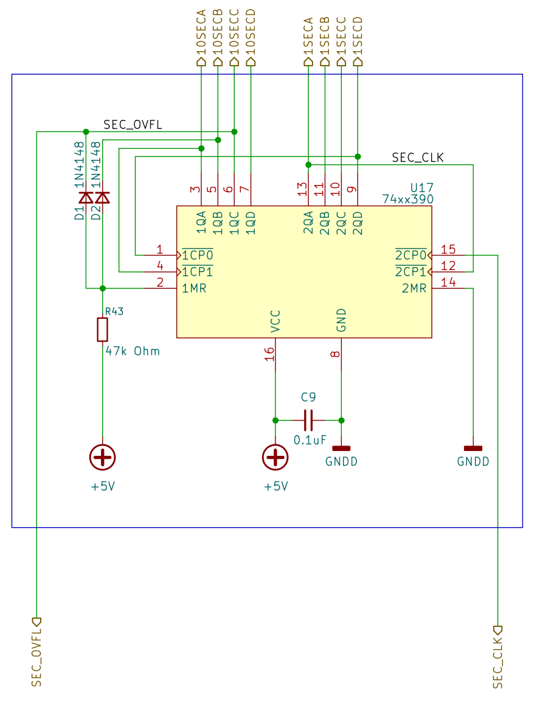
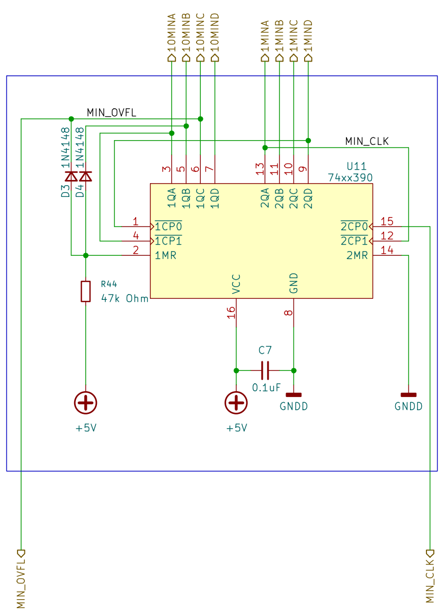
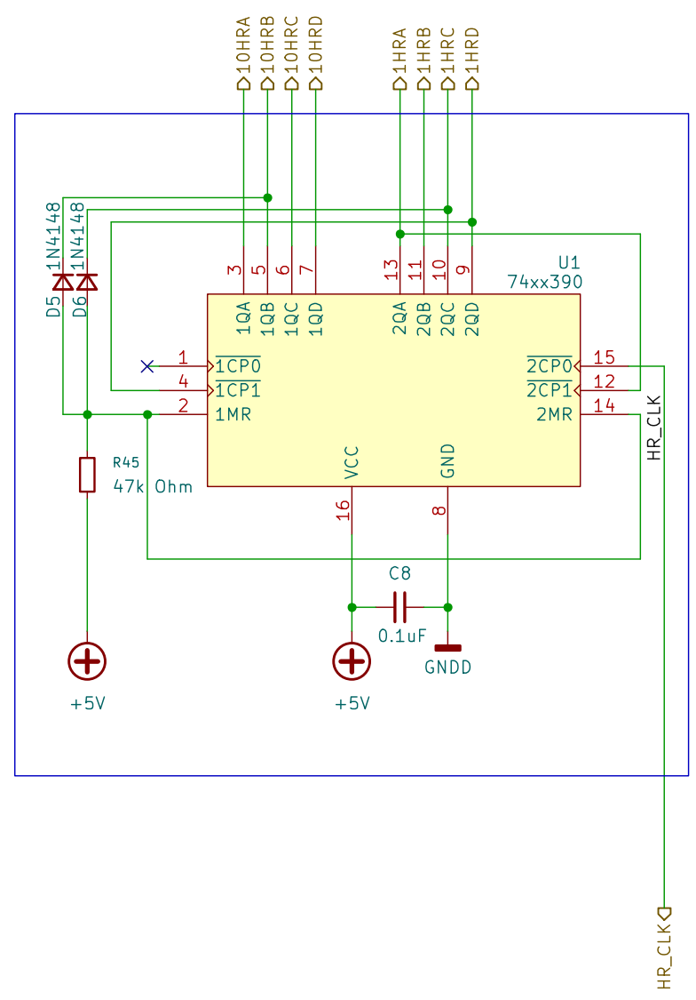

# วงจรนับเวลา (Counter) 

### Counter 00-59 วินาที

วงจรนี้ ประกอบด้วย Counter 2 ตัว โดยตัวแรกจะนับเลข 0-9 สำหรับหลักหน่วยวินาที และตัวที่สองจะนับเลข 0-5 สำหรับหลักสิบวินาที ซึ่งเมื่อรวมกันแล้วจะสามารถนับเวลาได้ตั้งแต่ 00 ถึง 59 วินาที

การนับ 0 - 9 เป็นพฤติกรรมปกติของ 74'390  ซึ่งเป็น Counter mod-10 ซึ่งจะรีเซ็ตกลับไปที่ 0 หลังจากนับถึง 9 และส่งสัญญาณ carry ไปยัง Counter ตัวถัดไปเพื่อเพิ่มค่าของหลักสิบวินาที

การนับ 0 - 5 สำหรับหลักสิบวินาที จะใช้ Counter mod-6 ซึ่งจะรีเซ็ตกลับไปที่ 0 หลังจากนับถึง 5 และส่งสัญญาณ carry ไปยัง Counter ตัวถัดไปเพื่อเพิ่มค่าของหลักนาที โดยอาศัยอุปกรณ์ภายนอก เช่น AND gate มาทำการรีเซ็ต Counter ตัวที่สองเมื่อมันนับถึง 6 เพื่อให้มันรีเซ็ตกลับไปที่ 0 และส่งสัญญาณ carry ไปยัง Counter ตัวถัดไป 

ในวงจรนี้ เราใช้ Diode ร่วมกับตัวต้านทานเพื่อทำการรีเซ็ต Counter ตัวที่สองเมื่อมันนับถึง 6 แทนการใช้ AND gate ซึ่งเป็นวิธีที่ง่ายและประหยัดอุปกรณ์มากกว่า 

ในการนับหลักสิบของวินาทีก่อนจะถึง 6 (0110) ไดโอดแต่ละตัวจะได้รับลอจิก 0 จาก output ของ  74'390  การต่อวงจรแบบนี้เข้าข่าย AND gate แบบจำลอง ซึ่งทำให้ขา 2 ของ 74390 เป็นลอจิก 0 อยู่ตลอดเวลา 

เมื่อมันนับถึง 6 (0110) ไดโอดทั้งสองตัวจะได้รับลอจิก 1 จาก output ของ 74'390 ทำให้ขา 2 ของ 74390 เป็นลอจิก 1 สภาวะเช่นนี้ทำให้มันรีเซ็ต 74390 ให้กลับไปที่ 0 พร้อมทั้งส่งสัญญาณ carry ไปยัง Counter ตัวถัดไปเพื่อเพิ่มค่าของหลักนาทีต่อไป     

เพื่อให้เข้าใจง่ายขึ้น จากการเชื่อมต่อในวงจร เราสามารถดูตารางความจริงการนับของ Counter วินาทีได้ดังนี้

| นับ | 1QA | 1QB | 1QC | 1QD | 1MR | เหตุการณ์                    |
| --- | --- | --- | --- | --- | --- | ---------------------------- |
| 0   | 0   | 0   | 0   | 0   | 1   | นับต่อไป                     |
| 1   | 1   | 0   | 0   | 0   | 1   | นับต่อไป                     |
| 2   | 0   | 1   | 0   | 0   | 1   | นับต่อไป                     |
| 3   | 1   | 1   | 0   | 0   | 1   | นับต่อไป                     |
| 4   | 0   | 0   | 1   | 0   | 1   | นับต่อไป                     |
| 5   | 1   | 0   | 1   | 0   | 1   | นับต่อไป                     |
| 6   | 0   | 1   | 1   | 0   | 0   | รีเซ็ต (1QA - 1QD เป็น 0000) |
| 7   | 1   | 1   | 1   | 0   | 0   | ไม่สามารถเกิดขึ้นได้         |

### Counter 00-59 นาที

การทำงานของ Counter นาทีจะเหมือนกับ Counter วินาที โดยใช้ Counter mod-10 สำหรับหลักหน่วยนาที และ Counter mod-6 สำหรับหลักสิบของนาที ซึ่งจะทำงานร่วมกันเพื่อให้นับได้ตั้งแต่ 00 ถึง 59 นาที

### Counter 00-23 ชั่วโมง

วงจรนับชั่วโมงจะมีความซับซ้อนมากขึ้นเล็กน้อย เนื่องจากต้องนับได้ตั้งแต่ 00 ถึง 23 ชั่วโมง  โชคดีที่เรามี counter mod-10 จำนวนสองตัวเรียงกันอยู่แล้ว แนวทางที่ง่ายที่สุดคือ การรีเซ็ต Counter ทั้งคู่เมื่อมันนับถึง 24 (0010 0100) โดยใช้ AND gate หรือ Diode ร่วมกับ Resistor แบบที่เราทำในวงจรนับหลักสิบของวินาที

แต่สิ่งที่ต่างจากวงจรนับวินาทีและนับนาทีคือ วงจรนี้เราจะนำเอาเลข 2 ของ Counter หลักสิบชั่วโมง (ซึ่งเป็นลอจิก 1 เมื่อมันนับถึง 2) มาร่วมกับเลข 4 ของ Counter หลักหน่วยชั่วโมง (ซึ่งเป็นลอจิก 1 เมื่อมันนับถึง 4) มาทำการรีเซ็ต Counter ทั้งคู่เมื่อมันนับถึง 24 (0010 0100) เพื่อให้มันรีเซ็ตกลับไปที่ 00 และเริ่มนับใหม่อีกครั้ง

1QA - 1QD เป็น output ของ Counter หลักสิบชั่วโมง ซึ่งจะนับจาก 0 ถึง 2 และเมื่อมันนับถึง 2 (0010) บิตที่ 3 จะเป็นลอจิก 1
2QA - 2QD เป็น output ของ Counter หลักหน่วยชั่วโมง ซึ่งจะนับจาก 0 ถึง 9 และเมื่อมันนับถึง 4 (0100) บิตที่ 2 จะเป็นลอจิก 1
(QA = LSB, QD = MSB)

เมื่อทั้งบิตที่ 2 ของ Counter หลักสิบชั่วโมงและบิตที่ 3 ของ Counter หลักหน่วยชั่วโมงเป็นลอจิก 1 พร้อมกัน มันจะให้เอาต์พุตเป็นลอจิก 1 ทำให้วงจรรีเซ็ตทำงาน รีเซ็ตทั้ง Counter หลักสิบชั่วโมงและหลักหน่วยชั่วโมงให้กลับไปที่ 00 และเริ่มนับใหม่อีกครั้ง

| นับ | 1QD | 1QC | 1QB | 1QA | 1MR | 2QD | 2QC | 2QB | 2QA | 2MR | เหตุการณ์                    |
| --- | --- | --- | --- | --- | --- | --- | --- | --- | --- | --- | ---------------------------- |
| 00   | 0   | 0   | 0   | 0   | 0   | 0   | 0   | 0   | 0   | 0   | นับต่อไป                     |
| 01   | 0   | 0   | 0   | 0   | 0   | 0   | 0   | 0   | 1   | 0   | นับต่อไป                     |
| 02   | 0   | 0   | 0   | 0   | 0   | 0   | 0   | 1   | 0   | 0   | นับต่อไป                     |
| 03   | 0   | 0   | 0   | 0   | 0   | 0   | 0   | 1   | 1   | 0   | นับต่อไป                     |
| 04   | 0   | 0   | 0   | 0   | 0   | 0   | 1   | 0    | 0   | 0   | นับต่อไป                     |
| 05   | 0   | 0   | 0   | 0   | 0   | 0   | 1   | 0    | 1   | 0   | นับต่อไป                     |
| 06   | 0   | 0   | 0   | 0   | 0   | 0   | 1   | 1    | 0   | 0   | นับต่อไป                     |
| 07   | 0   | 0   | 0   | 0   | 0   | 0   | 1   | 1    | 1   | 0   | นับต่อไป                     |
| 08   | 0   | 0   | 0   | 0   | 0   | 1   | 0   | 0    | 0   | 0   | นับต่อไป                     |
| 09   | 0   | 0   | 0   | 0   | 0   | 1   | 0   | 0    | 1   | 0   | นับต่อไป                     |  
| 10   | 0   | 0   | 0   | 1   | 0   | 1   | 0   | 1    | 0   | 0   | นับต่อไป                     |
| 11   | 0   | 0   | 0   | 1   | 0   | 1   | 0   | 1    | 1   | 0   | นับต่อไป                     |
| 12   | 0   | 0   | 0   | 1   | 0   | 1   | 1   | 0    | 0   | 0   | นับต่อไป                     |
| 13   | 0   | 0   | 0   | 1   | 0   | 1   | 1   | 0    | 1   | 0   | นับต่อไป                     |
| 14   | 0   | 0   | 0   | 1   | 0   | 1   | 1   | 1    | 0   | 0   | นับต่อไป                     |
| 15   | 0   | 0   | 0   | 1   | 0   | 1   | 1   | 1    | 1   | 0   | นับต่อไป                     |  
| 16   | 0   | 0   | 1   | 0   | 0   | 0   | 0   | 0    | 0   | 0   | นับต่อไป                     |
| 17   | 0   | 0   | 1   | 0   | 0   | 0   | 0   | 0    | 1   | 0   | นับต่อไป                     |
| 18   | 0   | 0   | 1   | 0   | 0   | 0   | 0   | 1    | 0   | 0   | นับต่อไป                     |
| 19   | 0   | 0   | 1   | 0   | 0   | 0   | 0   | 1    | 1   | 0   | นับต่อไป                     |
| 20   | 0   | 0   | 1   | 0   | 0   | 0   | 1   | 0    | 0   | 0   | นับต่อไป                     |
| 21   | 0   | 0   | 1   | 0   | 0   | 0   | 1   | 0    | 1   | 0   | นับต่อไป                     |
| 22   | 0   | 0   | 1   | 0   | 0   | 0   | 1   | 1    | 0   | 0   | นับต่อไป                     |
| 23   | 0   | 0   | 1   | 0   | 1   | 0   | 1   | 1    | 1   | 1   | รีเซ็ต (1QA - 2QD เป็น 0000) |   
| 24   | 0   | 0   | 0   | 0   | 0   | 0   | 0   | 0    | 0   | 0   | ไม่สามารถเกิดขึ้นได้           | 

