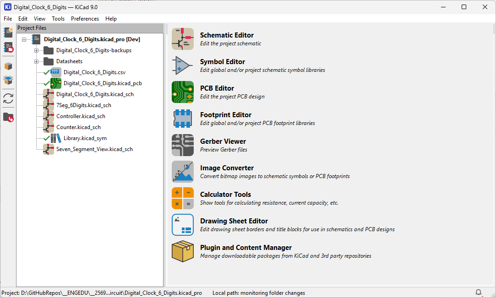
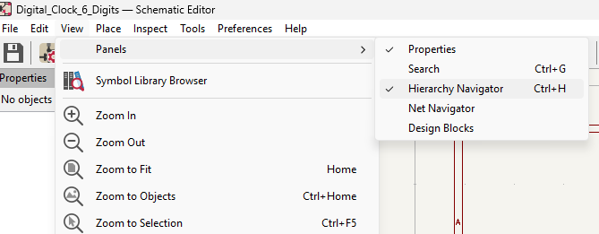
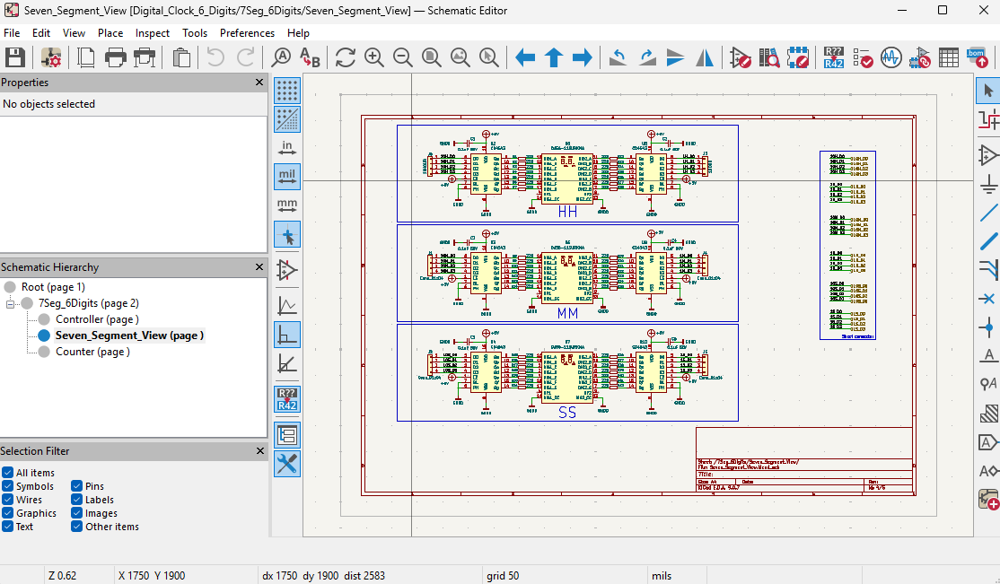

## Download and install Kicad

1. ดาวน์โหลด Kicad ได้จาก https://www.kicad.org/download/
2. ติดตั้งตามขั้นตอนปกติ
3. เปิดไฟล์ Digital_Clock_6_Digits.kicad_pro จากโฟลเดอร์ circuit  ใน repo นี้

 4. คลิกที่ไอคอน Schematic Editor จะเป็นการเปิดไฟล์ Digital_Clock_6_Digits.kicad_sch ซึ่งเป็น Schematic หลักที่เชื่อมโยงส่วนย่อยทั้งหมดในโปรเจคนี้

 
 5. คลิกเมนู View -> Panels -> Hierarchy Navigator หรือกด `Ctrl+H`   เพื่อเปิดแผง Hierarchy Navigator ที่ช่วยให้เราดูโครงสร้างของ Schematic ได้ง่ายขึ้น
  

6. จะเห็นแผง Hierarchy Navigator ที่แสดงโครงสร้างของ Schematic ในโปรเจคนี้ ซึ่งมีการแบ่งเป็นส่วนย่อย ๆ เพื่อความสะดวกในการออกแบบและแก้ไข ให้คลี่ออกมา แล้วคลิกที่ `Seven_Segment_View` เพื่อดูการเชื่อมต่อของ 7-Segment Display

นักศึกษาสามารถคลิกที่ส่วนอื่น ๆ ใน Hierarchy Navigator เพื่อดูรายละเอียดของแต่ละส่วนได้เช่นกัน เช่น Controller หรือ Counter ซึ่งจะช่วยให้เข้าใจการทำงานของวงจรได้ดีขึ้นครับ

**ในโปรเจคนี้เราใช้ KiCad ในการดูวงจรที่จะประกอบเท่านั้นนะครับ ไม่ได้ใช้ในการออกแบบวงจรใหม่** 

ถ้าอยากออกแบบวงจรใหม่ก็สามารถใช้ KiCad นี้ได้เลยครับ  
และถ้าต้องการเรียนรู้การใช้งาน KiCad เพิ่มเติมก็สามารถดูได้จากคู่มือออนไลน์ของ KiCad ได้เลยครับ https://docs.kicad.org/ หรือถ้ามีคำถามเพิ่มเติมก็สามารถเปิด issue มาได้เลยนะครับ