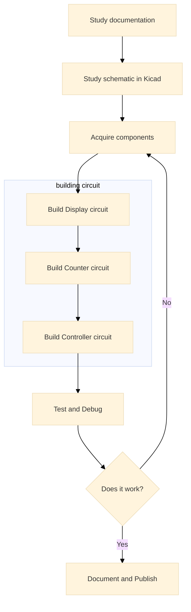

# Digital Clock 6 Digits

## คำแนะนำ
สร้างนาฬิกา Digital 6 Digit โดยใช้อุปกรณ์ที่เรียนในวิชา เพื่อแสดงเวลาในรูปแบบ HH:MM:SS โดยใช้หลักการทำงานของวงจร Digital Logic และ Counter 

โครงงานนี้ใช้วิธีการเดินสายด้วย Wire wrapping เพื่อลดขั้นตอนในการทำ PCB และเป็นการฝึกให้นักศึกษาได้บัดกรีวงจรที่มีความซับซ้อนในระดับที่เหมาะสม

รูปตัวอย่างของบอร์ดทั้งหมด ไม่ได้เป็นข้อบังคับให้นักศึกษาต้องทำให้เหมือน อีกทั้งนักศึกษาสามารถเพิ่มเติมฟังก์ชันที่ดีกว่าต้นฉบับได้ แต่ไม่ควรน้อยกว่าเป็นอันขาด

ไฟล์ทั้งหมดที่ใช้อธิบายการทำงานและสร้างโครงงาน อยู่ในโฟลเดอร์ Documents

#### ถ้ามีข้อสงสัยหรือต้องการคำอธิบายเพิ่ม ให้เปิด issue มาได้เลยนะครับ

## 🆘 ขี้เกียจอ่านยาว ๆ  เชิญทางนี้เลยครับ [🛝](./Documents/Short-Docs.md) 

## 🆘 หรือไม่อยากอ่านเลย อยากดูคลิปอย่างเดียว  ก็เชิญทางนี้เลยครับ [🎞️](./Documents/Video-Links.md) 

---

## 📐 สถาปัตยกรรม Hardware แบบ MVC (Model-View-Controller)

โปรเจคนี้ออกแบบโดยแบ่งส่วนการทำงานออกเป็น 3 ส่วนหลักตามแนวคิด MVC:

### 🎮 **Controller** - ส่วนควบคุมและสร้างสัญญาณ Clock
- **หน้าที่:** สร้างสัญญาณนาฬิกา (Clock Signal) ที่ความถี่ 1 Hz (1 วินาที/รอบ) พร้อมทั้งสวิตช์กดเพื่อการตั้งเวลา
- **อุปกรณ์หลักส่วนกำเนิดสัญญาณนาฬิกา:** 
  - NE555 Timer ในโหมด Astable เพื่อสร้าง Clock pulse
  - LED และตัวต้านทาน  
- **ผลลัพธ์:** สัญญาณ Clock ที่มีความแม่นยำสำหรับนับเวลา สามารถสังเกตุการทำงานจากการกระพริบของ LED

- **อุปกรณ์หลักส่วนตั้งเวลาสำหรับนาฬิกา:** 
  - สวิตช์กด push button ชนิด กดติดปล่อยดับ
  - ตัวต้านทาน  Pull-up หรือ Pull Down
  - ตัวเก็บประจุ debouncing
  - SN7414 Schmitt Trigger สำหรับปรับสัญญาณให้เสถียร
  - SN7474 D Flip-Flop สำหรับสลับโหมด (RUN/SETTIME)
  - SN74LS157 Multiplexer สำหรับเลือกเส้นทางสัญญาณสำหรับโหมด  RUN และ SETTIME
- **ผลลัพธ์:** การกดปุ่มแต่ละครั้ง ไม่มี bounce และสามารถเปลี่ยนโหมด (RUN/SETTIME) และเพิ่มค่าในหลัก HH:MM:SS ครั้งละ 1 ได้ตามต้องการ 

### 📊 **Model** - ส่วนประมวลผลและนับเวลา
- **หน้าที่:** นับและจัดเก็บค่าเวลา (ชั่วโมง นาที วินาที) ในรูปแบบ BCD
- **อุปกรณ์หลัก:**
  - SN74LS390 Decade Counter (นับเลข 0-9 และ 0-5)
- **โครงสร้างการนับ:**
  - วินาทีหลักหน่วย: 0-9 (ใช้ Counter mod-10)
  - วินาทีหลักสิบ: 0-5 (ใช้ Counter mod-6)
  - นาทีหลักหน่วย: 0-9 (ใช้ Counter mod-10)
  - นาทีหลักสิบ: 0-5 (ใช้ Counter mod-6)
  - ชั่วโมงหลักหน่วย: 0-9 (ใช้ Counter mod-10)
  - ชั่วโมงหลักสิบ: 0-2 (ใช้ Counter mod-3 สำหรับรูปแบบ 24 ชั่วโมง)

### 🖥️ **View** - ส่วนแสดงผล
- **หน้าที่:** แสดงค่าเวลาออกทาง 7-Segment Display
- **อุปกรณ์หลัก:**
  - CD4543 BCD-to-7-Segment Decoder (6 ตัว สำหรับแต่ละหลัก)
  - 7-Segment Display Common Cathode (6 หลัก)
- **การทำงาน:** รับค่า BCD จาก Model แปลงเป็นรหัส 7-Segment เพื่อแสดงผลตัวเลข 0-9

---

## 🔧 การทำงานของแต่ละส่วนในโปรเจค

### 1. ส่วน Clock Generator (NE555)
- สร้างสัญญาณสี่เหลี่ยมความถี่ ~1 Hz
- ใช้สูตรคำนวณ: $f = \frac{1.44}{(R_1 + 2R_2) \times C}$
- ค่าที่ใช้: R1 = 1kΩ, R2 = 6.8kΩ, C = 100µF
- ความถี่ที่ได้: 0.986 Hz (ความคลาดเคลื่อน 1.4%)

### 2. ส่วน Counter (SN74LS390)
**วินาที:**
- Counter ตัวที่ 1: นับหลักหน่วย 0→9 (mod-10)
- Counter ตัวที่ 2: นับหลักสิบ 0→5 (mod-6)
- เมื่อครบ 59 วินาที Reset และส่งสัญญาณ Carry ไปยังส่วนนาที

**นาที:**
- Counter ตัวที่ 3: นับหลักหน่วย 0→9 (mod-10)
- Counter ตัวที่ 4: นับหลักสิบ 0→5 (mod-6)
- เมื่อครบ 59 นาที Reset และส่งสัญญาณ Carry ไปยังส่วนชั่วโมง

**ชั่วโมง:**
- Counter ตัวที่ 5: นับหลักหน่วย 0→9 (mod-10)
- Counter ตัวที่ 6: นับหลักสิบ 0→2 (mod-3)
- เมื่อครบ 23:59:59 Reset กลับเป็น 00:00:00

### 3. ส่วน Display (CD4543 + 7-Segment)
- รับสัญญาณ BCD 4 บิตจาก Counter แต่ละหลัก
- CD4543 ทำหน้าที่แปลง BCD เป็นสัญญาณควบคุม 7-Segment (a-g)
- แสดงผลตัวเลข 0-9 บน 7-Segment Display

### 4. ส่วน Time Setting
- Switch สำหรับหยุดนับและปรับเวลา
- Push Button สำหรับตั้งค่าชั่วโมง/นาที/วินาที

---

## 📁 คำอธิบายไฟล์ในโปรเจค

### 📄 Markdown Documents
- **`Readme.md`** - เอกสารหลักของโปรเจค อธิบายภาพรวมและวิธีการทำงาน
- **[`Bill-of-materials.md`](Documents/Bill-of-materials.md)** - รายการอุปกรณ์ที่ใช้ในโปรเจค
- **[`Construction-Process.md`](Construction-Process-Display.md)** - ขั้นตอนการประกอบวงจรตามลำดับ
- **[`Datasheets.md`](Documents/Datasheets.md)** - รายละเอียด Datasheet ของ IC ที่ใช้ในวงจร
- **[`Kicad-Setup.md`](Documents/Kicad-Setup.md)** - คู่มือการตั้งค่าและใช้งาน KiCad
- **[`NE555_Clock.md`](NE555-Clock-Generator.md)** - การคำนวณและออกแบบวงจร NE555

### 🔌 Circuit Files (โฟลเดอร์ Circuit/)
- **[`Digital_Clock_6_Digits.kicad_pro`](Circuit/Digital_Clock_6_Digits.kicad_pro)** - ไฟล์โปรเจค KiCad หลัก
- **[`Digital_Clock_6_Digits.kicad_sch`](Circuit/Digital_Clock_6_Digits.kicad_sch)** - Schematic หลักที่เชื่อมโยงส่วนย่อย
- **[`Controller.kicad_sch`](Circuit/Controller.kicad_sch)** - วงจร NE555 Clock Generator
- **[`Counter.kicad_sch`](Circuit/Counter.kicad_sch)** - วงจร Counter ทุกหลัก (วินาที นาที ชั่วโมง)
- **[`7Seg_6Digits.kicad_sch`](Circuit/7Seg_6Digits.kicad_sch)** - วงจร Decoder และ Display 6 หลัก
- **[`Seven_Segment_View.kicad_sch`](Circuit/Seven_Segment_View.kicad_sch)** - มุมมองการเชื่อมต่อ 7-Segment
- **[`Digital_Clock_6_Digits.kicad_pcb`](Circuit/Digital_Clock_6_Digits.kicad_pcb)** - ไฟล์ออกแบบ PCB
- **[`Library.kicad_sym`](Circuit/Library.kicad_sym)** - ไลบรารีสัญลักษณ์ที่ใช้ในโปรเจค
- **[`Digital_Clock_6_Digits.csv`](Circuit/Digital_Clock_6_Digits.csv)** - Bill of Materials จาก KiCad

---

## 🛠️ ลำดับขั้นตอนการทำโปรเจค

### Phase 1: ศึกษาเอกสารต่างๆ (เริ่มจากไฟล์ Readme.md)
- [ ] **ศึกษา Datasheet** ของ IC แต่ละตัวให้เข้าใจการทำงาน โดยเฉพาะ:
	- [ ] CD4543 (BCD-to-7-Segment Decoder)
	- [ ] SN74LS390 (Decade Counter)
	- [ ] NE555 (Timer)
	- [ ] SN74LS157 (Multiplexer)

- [ ] **ศึกษาวงจรย่อย** แต่ละส่วนที่อาจารย์ให้ไว้:
	- [ ] วงจร Clock Generator (NE555)
	- [ ] วงจร Counter (SN74LS390) สำหรับ วินาที นาที ชั่วโมง
    - [ ] วงจร Display (CD4543 + 7-Segment)

- [ ]  **คำนวณค่าอุปกรณ์:** ถ้าอุปกรณ์ที่หามาได้ไม่ตรงกับค่าในวงจร 
	- [ ]  คำนวณ R และ C สำหรับ NE555 ให้ได้ความถี่ 1 Hz
	- [ ]  ตรวจสอบ Duty Cycle ให้อยู่ในช่วง 40-60%

### Phase 2: ศึกษาวงจรใน KiCad (ต้องลงโปรแกรม KiCad)
- [ ] **สร้าง Schematic แยกตามส่วน:**
    - [ ] `Controller.kicad_sch` - วงจร NE555
    - [ ] `Counter.kicad_sch` - วงจรนับเวลา
    - [ ] `7Seg_6Digits.kicad_sch` - วงจรแสดงผล
    - [ ] `Digital_Clock_6_Digits.kicad_sch` - เชื่อมโยงทุกส่วนเข้าด้วยกัน

- [ ] **ตรวจสอบความถูกต้อง:**
    - [ ] ตรวจสอบการเชื่อมต่อระหว่างส่วน
    - [ ] ตรวจสอบ Power Supply (VCC, GND)
    - [ ] ใช้มัลติมิเตอร์ตรวจสอบข้อผิดพลาด

### Phase 3: จัดหาอุปกรณ์ตามรายการ
- [ ] **จัดทำรายการอุปกรณ์ (BOM - Bill of Materials):**
    - [ ] IC ทั้งหมดตาม Schematic (CD4543, SN74LS390, NE555, SN74LS157, SN7414, SN7474)
    - [ ] 7-Segment Display Common Cathode 6 หลัก ควรใส่ Socket หรือ connector ตามคำแนะนำในการประกอบวงจร
    - [ ] ตัวต้านทาน (Resistor) ค่าต่างๆ ตามที่คำนวณไว้ในวงจร
    - [ ] ตัวเก็บประจุ (Capacitor) สำหรับวงจร NE555 และ Decoupling
    - [ ] แผ่นวงจรเอนกประสงค์ (Universal PCB) ขนาดที่เหมาะสม
    - [ ] IC Socket สำหรับ IC ทุกตัว (แนะนำให้ใช้เพื่อความสะดวกในการเปลี่ยน IC)
    - [ ] สาย Wire Wrap หรือสายเดินสายแบบอ่อน (Jumper Wire)
    - [ ] Push Button Switch สำหรับตั้งค่าเวลา
    - [ ] LED สำหรับแสดงสถานะ Clock
    - [ ] แหล่งจ่ายไฟ 5V (Adapter หรือ Battery)

- [ ] **ตรวจสอบอุปกรณ์:**
    - [ ] ตรวจสอบความถูกต้องของ IC ทุกตัวด้วย Datasheet
    - [ ] ทดสอบค่าตัวต้านทานและตัวเก็บประจุด้วย Multimeter
    - [ ] ตรวจสอบ 7-Segment Display ว่าเป็น Common Cathode
    - [ ] เตรียมอุปกรณ์สำรอง (IC, ตัวต้านทาน, สาย) กรณีชำรุด

### Phase 4: ประกอบส่วน Display
- [ ] **เตรียมอุปกรณ์สำหรับส่วน Display:**
    - [ ] IC Socket สำหรับ CD4543 (6 ตัว)
    - [ ] CD4543 BCD-to-7-Segment Decoder (6 ตัว)
    - [ ] 7-Segment Display Common Cathode (6 หลัก)
    - [ ] ตัวต้านทาน Current Limiting สำหรับ LED แต่ละ Segment
    - [ ] แผ่นวงจรเอนกประสงค์ขนาดพอเหมาะ

- [ ] **วางตำแหน่ง Component:**
    - [ ] วาง 7-Segment Display ให้เรียงตามลำดับ (HH:MM:SS)
    - [ ] วาง IC Socket สำหรับ CD4543 ไว้ใกล้กับ 7-Segment แต่ละหลัก
    - [ ] วางตำแหน่งให้พิจารณาเส้นทางการเดินสายไปยัง Counter (ส่วนถัดไป)
    - [ ] สามารถวางตามตัวอย่างในรูปชิ้นงานที่สำเร็จแล้วได้ 

- [ ] **บัดกรี Component:**
    - [ ] บัดกรี 7-Segment Display ทั้ง 6 หลัก ตรวจสอบให้แน่ใจว่าหลักตรง
    - [ ] บัดกรี IC Socket สำหรับ CD4543 ทั้ง 6 ตัว ตรวจสอบทิศทางขา 1
    - [ ] บัดกรีตัวต้านทาน Current Limiting สำหรับแต่ละ Segment

- [ ] **เดินสายด้วย Wire Wrap:**
    - [ ] เชื่อมต่อสาย VCC และ GND ให้ทุก IC (ควรเดินสายเป็นแนว Bus)
    - [ ] เชื่อมต่อสาย Output a-g จาก CD4543 ไปยัง 7-Segment แต่ละหลัก
    - [ ] เชื่อมต่อขา Common Cathode ของ 7-Segment ทั้งหมดไปยัง GND
    - [ ] เตรียมจุดต่อสำหรับสาย Input BCD (4 บิต) จากส่วน Counter

- [ ] **ทดสอบส่วน Display:**
    - [ ] **ยังไม่ต้องใส่ CD4543 ลงใน IC Socket**
    - [ ] จ่ายไฟ 5V ตรวจสอบแรงดันที่ขาไฟเลี้ยงและ ground ของ IC ทุกตัว
    - [ ] ถ้าวัดไฟแล้วไม่มีอะไรผิดพลาด ให้ปลดไฟเลี้ยงออกแล้วเสียบ IC ลงไปใน socket โดยทำจากหลักวินาทีเพียงตัวเดียวก่อน
    - [ ] จ่ายไฟเข้าวงจร IC ต้องไม่ร้อนกว่าปกติ วัดแรงดันไฟเลี้ยงควรได้เท่ากับตอนที่ยังไม่เสียบ IC 
    - [ ] ทดสอบการแสดงผลด้วยการจ่ายสัญญาณ BCD แบบ Manual (ใช้สวิตช์หรือสาย Jumper)
    - [ ] ตรวจสอบว่าแต่ละหลักสามารถแสดงตัวเลข 0-9 ได้ถูกต้อง
    - [ ] บันทึกปัญหาที่พบ (ถ้ามี) เช่น Segment ที่ไม่ติด

### Phase 5: ประกอบส่วน Counter
- [ ] **เตรียมอุปกรณ์สำหรับส่วน Counter:**
    - [ ] IC Socket สำหรับ SN74LS390 (3 ตัว สำหรับ วินาที นาที ชั่วโมง)
    - [ ] SN74LS390 Dual Decade Counter (3 ตัว)
    - [ ] ตัวเก็บประจุ Decoupling 0.1µF สำหรับแต่ละ IC
    - [ ] แผ่นวงจรเอนกประสงค์ขนาดพอเหมาะ (หรือใช้แผ่นเดียวกับ Display)

- [ ] **วางตำแหน่ง Component:**
    - [ ] วาง IC Socket สำหรับ Counter ตามลำดับ: วินาที → นาที → ชั่วโมง
    - [ ] วางให้สะดวกต่อการเชื่อมต่อกับส่วน Display และ Controller
    - [ ] คำนึงถึงการเดินสายระหว่าง Counter แต่ละหลัก (Cascade)
    - [ ] สามารถวางตำแหน่งตามในรูปวงจรต้นแบบได้

- [ ] **บัดกรี Component:**
    - [ ] บัดกรี IC Socket สำหรับ SN74LS390 ทั้ง 3 ตัว
    - [ ] บัดกรีตัวเก็บประจุ Decoupling ไว้ใกล้ขา VCC และ GND ของแต่ละ IC
    - [ ] บัดกรี IC Logic Gate เพิ่มเติม (ถ้ามี) สำหรับวงจร Reset

- [ ] **เดินสายด้วย Wire Wrap:**
    - [ ] เชื่อมต่อสาย VCC และ GND ให้ทุก IC
    - [ ] **วงจรวินาที:** บัดกรีวงจรตามที่แสดงใน Kicad
        - [ ] เชื่อมต่อ Clock Input สำหรับนับวินาทีหลักหน่วย (0-9)
        - [ ] เชื่อมต่อ Carry Output ไปยังหลักสิบ (0-5)
        - [ ] ต่อขา Output BCD (4 บิต) ของทั้ง 2 หลักไปยังส่วน Display
        - [ ] ต่อวงจร Reset เมื่อครบ 59 → 00
    - [ ] **วงจรนาที:** บัดกรีวงจรตามที่แสดงใน Kicad
        - [ ] รับ Clock Input จาก Carry ของวินาทีหลักสิบ
        - [ ] เชื่อมต่อ Carry Output ไปยังหลักสิบ (0-5)
        - [ ] ต่อขา Output BCD ไปยังส่วน Display
        - [ ] ต่อวงจร Reset เมื่อครบ 59 → 00
    - [ ] **วงจรชั่วโมง:** บัดกรีวงจรตามที่แสดงใน Kicad
        - [ ] รับ Clock Input จาก Carry ของนาทีหลักสิบ
        - [ ] เชื่อมต่อหลักหน่วย (0-9) และหลักสิบ (0-2)
        - [ ] ต่อขา Output BCD ไปยังส่วน Display
        - [ ] ต่อวงจร Reset เมื่อครบ 23 → 00 (รูปแบบ 24 ชั่วโมง)

- [ ] **เชื่อมต่อส่วน Display เข้ากับ Connector ทั้ง 6 ตัว:**
    - [ ] ต่อสาย BCD Output จาก Counter แต่ละหลักไปยัง Input ของ CD4543
    - [ ] ตรวจสอบความถูกต้องของการต่อสาย (bit 0-3)

- [ ] **ทดสอบส่วน Counter:**
    - [ ] ใส่ IC SN74LS390 ลงใน IC Socket ทุกตัว
    - [ ] จ่ายไฟ 5V และตรวจสอบแรงดันที่ IC ทุกตัว
    - [ ] จ่ายสัญญาณ Clock แบบ Manual (กดปุ่มหรือใช้ Switch)
    - [ ] ตรวจสอบการนับของวินาที: 00 → 01 → ... → 09 → 10 → ... → 59 → 00
    - [ ] ตรวจสอบ Carry Signal ส่งต่อไปยังนาทีเมื่อวินาทีครบ 59
    - [ ] ตรวจสอบการนับของนาทีและชั่วโมงแบบเดียวกัน
    - [ ] ตรวจสอบว่าเมื่อครบ 23:59:59 แล้ว จะ Reset เป็น 00:00:00

### Phase 6: ประกอบส่วน Controller (Clock Generator และ Time Setting)
- [ ] **เตรียมอุปกรณ์สำหรับส่วน Controller:**
    - [ ] IC Socket สำหรับ NE555, SN7414, SN7474, SN74LS157
    - [ ] NE555 Timer IC
    - [ ] SN7414 Schmitt Trigger (สำหรับปรับสัญญาณ)
    - [ ] SN7474 D Flip-Flop (สำหรับสลับโหมด RUN/SETTIME)
    - [ ] SN74LS157 Multiplexer (สำหรับเลือกสัญญาณ Clock)
    - [ ] ตัวต้านทาน 1kΩ, 6.8kΩ (หรือค่าที่คำนวณได้)
    - [ ] ตัวเก็บประจุ 100µF (หรือค่าที่คำนวณได้)
    - [ ] Push Button Switch (สำหรับ Mode Switch, Hour, Minute, Second)
    - [ ] LED สำหรับแสดงสถานะ Clock และโหมด
    - [ ] ตัวต้านทาน Pull-up/Pull-down สำหรับปุ่ม
    - [ ] ตัวเก็บประจุ Debouncing สำหรับปุ่มกด
    - [ ] แผ่นวงจรเอนกประสงค์ขนาดพอเหมาะ

- [ ] **ส่วน Clock Generator (NE555):**
    - [ ] บัดกรี IC Socket สำหรับ NE555
    - [ ] บัดกรีตัวต้านทาน R1 (1kΩ) และ R2 (6.8kΩ)
    - [ ] บัดกรีตัวเก็บประจุ C (100µF)
    - [ ] บัดกรี LED และตัวต้านทาน Current Limiting
    - [ ] เดินสายตาม Schematic ของ NE555 Astable Mode
    - [ ] เชื่อม Output ของ NE555 ไปยัง SN7414 (Schmitt Trigger)

- [ ] **ส่วน Time Setting:**
    - [ ] บัดกรี Push Button ทั้งหมด (Mode, Hour, Minute, Second)
    - [ ] บัดกรีตัวต้านทาน Pull-up/Pull-down สำหรับปุ่มแต่ละตัว
    - [ ] บัดกรีตัวเก็บประจุ Debouncing ควบคู่กับปุ่ม
    - [ ] บัดกรี IC Socket สำหรับ SN7414, SN7474, SN74LS157
    - [ ] เดินสาย Output จากปุ่มผ่าน SN7414 เพื่อปรับสัญญาณให้เสถียร
    - [ ] เดินสายจาก SN7474 เพื่อสลับระหว่างโหมด RUN และ SETTIME
    - [ ] เดินสายจาก SN74LS157 เพื่อเลือก Clock Source:
        - [ ] โหมด RUN: ใช้สัญญาณจาก NE555 (1 Hz)
        - [ ] โหมด SETTIME: ใช้สัญญาณจากปุ่มกด (Manual Clock)

- [ ] **เชื่อมต่อกับส่วน Counter:**
    - [ ] ต่อ Output จาก Multiplexer (SN74LS157) ไปยัง Clock Input ของ Counter
    - [ ] ต่อสัญญาณจากปุ่ม Hour, Minute, Second ไปยัง Clock Input ของ Counter ที่เกี่ยวข้อง (ผ่าน Multiplexer)

- [ ] **ทดสอบส่วน Controller:**
    - [ ] **ทดสอบ NE555 Clock Generator:**
        - [ ] จ่ายไฟ 5V และสังเกตการกระพริบของ LED
        - [ ] ถ้าสามารถ ให้วัดความถี่ด้วย Oscilloscope หรือ Frequency Counter (ควรได้ ~1 Hz)
        - [ ] ถ้าสามารถ ให้วัด Duty Cycle ควรอยู่ในช่วง 40-60%
    - [ ] **ทดสอบ Push Button และ Debouncing:**
        - [ ] กดปุ่มแต่ละตัวและตรวจสอบว่าไม่มี Bounce (อาจจะใช้ Oscilloscope หรือ Logic Probe แต่จากการออกแบบวงจร ไม่ควรจะเกิด bounce ถ้าบัดกรีถูกต้อง)
        - [ ] ตรวจสอบว่า Schmitt Trigger ทำงานถูกต้อง
    - [ ] **ทดสอบ Mode Switch (RUN/SETTIME):**
        - [ ] กดปุ่ม Mode และตรวจสอบว่า D Flip-Flop สลับสถานะ
        - [ ] ตรวจสอบว่า LED แสดงโหมดปัจจุบัน (RUN หรือ SETTIME)
    - [ ] **ทดสอบ Multiplexer:**
        - [ ] ในโหมด RUN: Counter ต้องนับตามสัญญาณจาก NE555 (1 วินาที/ครั้ง)
        - [ ] ในโหมด SETTIME: การกดปุ่ม Hour/Minute/Second ต้องเพิ่มค่าในหลักที่ถูกต้อง

### Phase 7: การทดสอบและแก้ไขปัญหา (Testing & Debugging)
- [ ] **ทดสอบการทำงานของแต่ละส่วนร่วมกัน:**
    - [ ] เชื่อมต่อทุกส่วนเข้าด้วยกัน: Controller → Counter → Display
    - [ ] จ่ายไฟ 5V และตรวจสอบแรงดันที่ IC ทุกตัว (ควรได้ 4.75-5.25V)
    - [ ] สังเกตการแสดงผลบน 7-Segment Display

- [ ] **ทดสอบโหมด RUN (การทำงานปกติ):**
    - [ ] ตั้งเวลาเริ่มต้นเป็น 00:00:00
    - [ ] สังเกตการนับวินาที ควรเพิ่มทีละ 1 ทุกวินาที
    - [ ] ตรวจสอบการ Carry: 00:00:59 → 00:01:00, 00:59:59 → 01:00:00
    - [ ] ทดสอบการ Reset เมื่อครบ 23:59:59 → 00:00:00
    - [ ] ให้วงจรทำงานต่อเนื่อง 1-2 ชั่วโมง เพื่อตรวจสอบความเสถียร

- [ ] **ทดสอบโหมด SETTIME (การตั้งเวลา):**
    - [ ] กดปุ่ม Mode เพื่อเข้าสู่โหมด SETTIME
    - [ ] กดปุ่ม Hour และตรวจสอบว่าชั่วโมงเพิ่มขึ้น
    - [ ] กดปุ่ม Minute และตรวจสอบว่านาทีเพิ่มขึ้น
    - [ ] กดปุ่ม Second และตรวจสอบว่าวินาทีเพิ่มขึ้น
    - [ ] กดปุ่ม Mode อีกครั้งเพื่อกลับสู่โหมด RUN
    - [ ] ตรวจสอบว่านาฬิกานับต่อจากเวลาที่ตั้งไว้

- [ ] **ทดสอบความแม่นยำของเวลา:**
    - [ ] เปรียบเทียบกับนาฬิกามาตรฐาน (นาฬิกาข้อมือ, โทรศัพท์)
    - [ ] ให้วงจรทำงานต่อเนื่อง 24 ชั่วโมง
    - [ ] วัดความคลาดเคลื่อนของเวลา (ควรไม่เกิน ±1-2 นาที/วัน)
    - [ ] หากความคลาดเคลื่อนมาก ให้ปรับค่า R หรือ C ของ NE555

- [ ] **การแก้ไขปัญหาทั่วไป:**
    - [ ] **Display ไม่แสดงผล:**
        - [ ] ตรวจสอบการต่อขา IC และ 7-Segment
        - [ ] ตรวจวัดแรงดันที่ขา VCC และ GND
        - [ ] ตรวจสอบตัวต้านทาน Current Limiting
    - [ ] **Counter นับไม่ถูกต้อง:**
        - [ ] ตรวจสอบสัญญาณ Clock ด้วย Oscilloscope หรือ Logic Probe
        - [ ] ตรวจสอบวงจร Reset (อาจ Reset บ่อยเกินไปหรือไม่ Reset)
        - [ ] ตรวจสอบการต่อ Carry Signal ระหว่าง Counter
    - [ ] **Clock ความถี่ไม่ถูกต้อง:**
        - [ ] วัดค่าจริงของ R และ C ด้วย Multimeter
        - [ ] คำนวณความถี่ใหม่และปรับค่า R หรือ C
        - [ ] ตรวจสอบการต่อวงจร NE555
    - [ ] **ปุ่มกดมี Bounce:**
        - [ ] เพิ่มตัวเก็บประจุ Debouncing (0.1-1µF)
        - [ ] ตรวจสอบวงจร Schmitt Trigger
    - [ ] **นาฬิกาหยุดทำงานหลังทำงานได้สักพัก:**
        - [ ] ตรวจสอบการบัดกรีที่หลวม (Cold Solder Joint)
        - [ ] ตรวจสอบแหล่งจ่ายไฟว่ามีกระแส (Current) เพียงพอ
        - [ ] เพิ่มตัวเก็บประจุ Decoupling ที่ IC ทุกตัว

### Phase 8: เอกสารและการสรุปผล (Documentation)
- [ ] **ถ่ายภาพและวิดีโอ:**
    - [ ] ถ่ายภาพวงจรที่ประกอบเสร็จจากหลายมุม
    - [ ] ถ่ายภาพ Close-up ของแต่ละส่วนสำคัญ (Display, Counter, Controller)
    - [ ] ถ่ายภาพการเดินสายด้วย Wire Wrap
    - [ ] ถ่ายวิดีโอการทำงานของนาฬิกา ให้เห็นการเปลี่ยนวินาที 57 --> 58 --> 59 --> 00 --> 01 (อย่างน้อย 5 นาที) ทั้งในหลัก วินาที  --> นาที, นาที --> ชั่วโมง และเมื่อเปลี่ยน 23:59:xx ไปเป็น 00:00:xx
    - [ ] ถ่ายวิดีโอการตั้งเวลา (แสดงการใช้งานปุ่มกด)

- [ ] **บันทึกข้อมูลทางเทคนิค:**
    - [ ] รายการ IC ทั้งหมดที่ใช้พร้อมรุ่นและจำนวน
    - [ ] ค่าตัวต้านทานและตัวเก็บประจุที่ใช้จริง
    - [ ] ค่าความถี่ของ Clock ที่วัดได้
    - [ ] ความคลาดเคลื่อนของเวลาที่วัดได้
    - [ ] BOM (Bill of Materials) ฉบับสมบูรณ์

- [ ] **บันทึกปัญหาและวิธีแก้ไข:**
    - [ ] ปัญหาที่พบระหว่างการประกอบและทดสอบ
    - [ ] วิธีการแก้ไขปัญหาแต่ละอย่าง
    - [ ] ข้อผิดพลาดที่เกิดขึ้นและบทเรียนที่ได้รับ
    - [ ] คำแนะนำสำหรับผู้ที่จะทำโปรเจคนี้ต่อไป

- [ ] **เขียนเอกสารสรุป:**
    - [ ] วัตถุประสงค์ของโปรเจค
    - [ ] หลักการทำงานของนาฬิกา Digital
    - [ ] การออกแบบวงจรและการคำนวณ
    - [ ] ขั้นตอนการประกอบโดยสังเขป
    - [ ] ผลการทดสอบและประเมินความสำเร็จ
    - [ ] สรุปและข้อเสนอแนะ

- [ ] **เผยแพร่บน GitHub (ถ้าต้องการ):**
    - [ ] อัพโหลดไฟล์ Schematic (KiCad)
    - [ ] อัพโหลดรูปภาพ
    - [ ] อัพโหลดวิดีโอขึ้น YouTube และแปะลิ้งค์ไว้บน Github
    - [ ] อัพเดต README.md ให้มีข้อมูลครบถ้วน
    - [ ] เพิ่ม Bill of Materials (BOM)
    - [ ] เพิ่มคู่มือการประกอบ (Construction Process)
    - [ ] เขียน License และ Contributors
    - [ ] เปิดให้ผู้สนใจสามารถเปิด Issue หรือ Pull Request ได้

---

## 📚 เอกสารอ้างอิง
- [Bill of Materials](./Documents/Bill-of-materials.md) - รายการอุปกรณ์
- [Construction Process](./Documents/Construction-Process-Display.md) - ขั้นตอนการประกอบ
- [Datasheets](./Documents/Datasheets.md) - ข้อมูล IC ที่ใช้
- [NE555 Clock Calculation](./Documents/Progression/NE555_Clock.md) - การคำนวณวงจร Clock

---

## วงจรที่ประกอบสำเร็จแล้ว

