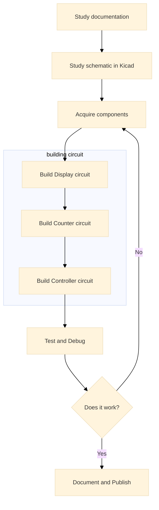

# Digital Clock 6 Digits

## คำแนะนำ
สร้างนาฬิกา Digital 6 Digit โดยใช้อุปกรณ์ที่เรียนในวิชา เพื่อแสดงเวลาในรูปแบบ HH:MM:SS โดยใช้หลักการทำงานของวงจร Digital Logic และ Counter 

โครงงานนี้ใช้วิธีการเดินสายด้วย Wire wrapping เพื่อลดขั้นตอนในการทำ PCB และเป็นการฝึกให้นักศึกษาได้บัดกรีวงจรที่มีความซับซ้อนในระดับที่เหมาะสม

รูปตัวอย่างของบอร์ดทั้งหมด ไม่ได้เป็นข้อบังคับให้นักศึกษาต้องทำให้เหมือน อีกทั้งนักศึกษาสามารถเพิ่มเติมฟังก์ชันที่ดีกว่าต้นฉบับได้ แต่ไม่ควรน้อยกว่าเป็นอันขาด

ไฟล์ทั้งหมดที่ใช้อธิบายการทำงานและสร้างโครงงาน อยู่ในโฟลเดอร์ Documents

#### ถ้ามีข้อสงสัยหรือต้องการคำอธิบายเพิ่ม ให้เปิด issue มาได้เลยนะครับ

---

## 📐 สถาปัตยกรรม Hardware แบบ MVC (Model-View-Controller)

โปรเจคนี้ออกแบบโดยแบ่งส่วนการทำงานออกเป็น 3 ส่วนหลักตามแนวคิด MVC:

### 🎮 **Controller** - ส่วนควบคุมและสร้างสัญญาณ Clock
- **หน้าที่:** สร้างสัญญาณนาฬิกา (Clock Signal) ที่ความถี่ 1 Hz (1 วินาที/รอบ) พร้อมทั้งสวิตช์กดเพื่อการตั้งเวลา
- **อุปกรณ์หลักส่วนกำเนิดสัญญาณนาฬิกา:** 
  - NE555 Timer ในโหมด Astable เพื่อสร้าง Clock pulse
  - LED และตัวต้านทาน  
- **ผลลัพธ์:** สัญญาณ Clock ที่มีความแม่นยำสำหรับนับเวลา สามารถสังเกตุการทำงานจากการกระพริบของ LED

- **อุปกรณ์หลักส่วนตั้งเวลาสำหรับนาฬิกา:** 
  - สวิตช์กด push button ชนิด กดติดปล่อยดับ
  - ตัวต้านทาน  Pull-up หรือ Pull Down
  - ตัวเก็บประจุ debouncing
  - SN7414 Schmitt Trigger สำหรับปรับสัญญาณให้เสถียร
  - SN7474 D Flip-Flop สำหรับสลับโหมด (RUN/SETTIME)
  - SN74LS157 Multiplexer สำหรับเลือกเส้นทางสัญญาณสำหรับโหมด  RUN และ SETTIME
- **ผลลัพธ์:** การกดปุ่มแต่ละครั้ง ไม่มี bounce และสามารถเปลี่ยนโหมด (RUN/SETTIME) และเพิ่มค่าในหลัก HH:MM:SS ครั้งละ 1 ได้ตามต้องการ 

### 📊 **Model** - ส่วนประมวลผลและนับเวลา
- **หน้าที่:** นับและจัดเก็บค่าเวลา (ชั่วโมง นาที วินาที) ในรูปแบบ BCD
- **อุปกรณ์หลัก:**
  - SN74LS390 Decade Counter (นับเลข 0-9 และ 0-5)
- **โครงสร้างการนับ:**
  - วินาทีหลักหน่วย: 0-9 (ใช้ Counter mod-10)
  - วินาทีหลักสิบ: 0-5 (ใช้ Counter mod-6)
  - นาทีหลักหน่วย: 0-9 (ใช้ Counter mod-10)
  - นาทีหลักสิบ: 0-5 (ใช้ Counter mod-6)
  - ชั่วโมงหลักหน่วย: 0-9 (ใช้ Counter mod-10)
  - ชั่วโมงหลักสิบ: 0-2 (ใช้ Counter mod-3 สำหรับรูปแบบ 24 ชั่วโมง)

### 🖥️ **View** - ส่วนแสดงผล
- **หน้าที่:** แสดงค่าเวลาออกทาง 7-Segment Display
- **อุปกรณ์หลัก:**
  - CD4543 BCD-to-7-Segment Decoder (6 ตัว สำหรับแต่ละหลัก)
  - 7-Segment Display Common Cathode (6 หลัก)
- **การทำงาน:** รับค่า BCD จาก Model แปลงเป็นรหัส 7-Segment เพื่อแสดงผลตัวเลข 0-9

---

## 🔧 การทำงานของแต่ละส่วนในโปรเจค

### 1. ส่วน Clock Generator (NE555)
- สร้างสัญญาณสี่เหลี่ยมความถี่ ~1 Hz
- ใช้สูตรคำนวณ: $f = \frac{1.44}{(R_1 + 2R_2) \times C}$
- ค่าที่ใช้: R1 = 1kΩ, R2 = 6.8kΩ, C = 100µF
- ความถี่ที่ได้: 0.986 Hz (ความคลาดเคลื่อน 1.4%)

### 2. ส่วน Counter (SN74LS390)
**วินาที:**
- Counter ตัวที่ 1: นับหลักหน่วย 0→9 (mod-10)
- Counter ตัวที่ 2: นับหลักสิบ 0→5 (mod-6)
- เมื่อครบ 59 วินาที Reset และส่งสัญญาณ Carry ไปยังส่วนนาที

**นาที:**
- Counter ตัวที่ 3: นับหลักหน่วย 0→9 (mod-10)
- Counter ตัวที่ 4: นับหลักสิบ 0→5 (mod-6)
- เมื่อครบ 59 นาที Reset และส่งสัญญาณ Carry ไปยังส่วนชั่วโมง

**ชั่วโมง:**
- Counter ตัวที่ 5: นับหลักหน่วย 0→9 (mod-10)
- Counter ตัวที่ 6: นับหลักสิบ 0→2 (mod-3)
- เมื่อครบ 23:59:59 Reset กลับเป็น 00:00:00

### 3. ส่วน Display (CD4543 + 7-Segment)
- รับสัญญาณ BCD 4 บิตจาก Counter แต่ละหลัก
- CD4543 ทำหน้าที่แปลง BCD เป็นสัญญาณควบคุม 7-Segment (a-g)
- แสดงผลตัวเลข 0-9 บน 7-Segment Display

### 4. ส่วน Time Setting (Optional)
- Switch สำหรับหยุดนับและปรับเวลา
- Push Button สำหรับตั้งค่าชั่วโมง/นาที/วินาที

---

## 📁 คำอธิบายไฟล์ในโปรเจค

### 📄 Markdown Documents
- **`Readme.md`** - เอกสารหลักของโปรเจค อธิบายภาพรวมและวิธีการทำงาน
- **`Bill-of-materials.md`** - รายการอุปกรณ์ที่ใช้ในโปรเจค
- **`Construction-Process.md`** - ขั้นตอนการประกอบวงจรตามลำดับ
- **`Datasheet.md`** - รายละเอียด Datasheet ของ IC ที่ใช้ในวงจร
- **`Kicad-Setup.md`** - คู่มือการตั้งค่าและใช้งาน KiCad

### 🔌 Circuit Files (โฟลเดอร์ Circuit/)
- **`Digital_Clock_6_Digits.kicad_pro`** - ไฟล์โปรเจค KiCad หลัก
- **`Digital_Clock_6_Digits.kicad_sch`** - Schematic หลักที่เชื่อมโยงส่วนย่อย
- **`Controller.kicad_sch`** - วงจร NE555 Clock Generator
- **`Counter.kicad_sch`** - วงจร Counter ทุกหลัก (วินาที นาที ชั่วโมง)
- **`7Seg_6Digits.kicad_sch`** - วงจร Decoder และ Display 6 หลัก
- **`Seven_Segment_View.kicad_sch`** - มุมมองการเชื่อมต่อ 7-Segment
- **`Digital_Clock_6_Digits.kicad_pcb`** - ไฟล์ออกแบบ PCB
- **`Library.kicad_sym`** - ไลบรารีสัญลักษณ์ที่ใช้ในโปรเจค
- **`Digital_Clock_6_Digits.csv`** - Bill of Materials จาก KiCad

### 📚 โฟลเดอร์ Progression/
- **`NE555_Clock.md`** - การคำนวณและออกแบบวงจร NE555

### 🖼️ โฟลเดอร์ Images/
- รูปภาพวงจรที่ประกอบเสร็จแล้ว

---

## 🛠️ ลำดับขั้นตอนการทำโปรเจค

### Phase 1: ศึกษาเอกสารต่างๆ (เริ่มจากไฟล์ Readme.md)
- [ ] **ศึกษา Datasheet** ของ IC แต่ละตัวให้เข้าใจการทำงาน โดยเฉพาะ:
	- [ ] CD4543 (BCD-to-7-Segment Decoder)
	- [ ] SN74LS390 (Decade Counter)
	- [ ] NE555 (Timer)
	- [ ] SN74LS157 (Multiplexer)

- [ ] **ศึกษาวงจรย่อย** แต่ละส่วนที่อาจารย์ให้ไว้:
	- [ ] วงจร Clock Generator (NE555)
	- [ ] วงจร Counter (SN74LS390) สำหรับ วินาที นาที ชั่วโมง
    - [ ] วงจร Display (CD4543 + 7-Segment)

- [ ]  **คำนวณค่าอุปกรณ์:** ถ้าอุปกรณ์ที่หามาได้ไม่ตรงกับค่าในวงจร 
	- [ ]  คำนวณ R และ C สำหรับ NE555 ให้ได้ความถี่ 1 Hz
	- [ ]  ตรวจสอบ Duty Cycle ให้อยู่ในช่วง 40-60%

### Phase 2: ศึกษาวงจรใน KiCad (ต้องลงโปรแกรม KiCad)
- [ ] **สร้าง Schematic แยกตามส่วน:**
    - [ ] `Controller.kicad_sch` - วงจร NE555
    - [ ] `Counter.kicad_sch` - วงจรนับเวลา
    - [ ] `7Seg_6Digits.kicad_sch` - วงจรแสดงผล
    - [ ] `Digital_Clock_6_Digits.kicad_sch` - เชื่อมโยงทุกส่วนเข้าด้วยกัน

- [ ] **ตรวจสอบความถูกต้อง:**
    - [ ] ตรวจสอบการเชื่อมต่อระหว่างส่วน
    - [ ] ตรวจสอบ Power Supply (VCC, GND)
    - [ ] ใช้ ERC (Electrical Rules Check) ตรวจสอบข้อผิดพลาด

### Phase 3: จัดหาอุปกรณ์ตามรายการ
- [ ] **วาง Component บน PCB:**
    - [ ] จัดเรียง IC ตามลำดับการทำงาน (Clock → Counter → Display)
    - [ ] วาง 7-Segment ให้อ่านง่าย

- [ ] **เดินสาย (Routing):**
   - [ ] เดินสาย Power และ Ground ให้กว้างและมั่นคง
   - [ ] เดินสาย Signal ให้สั้นที่สุด
   - [ ] ตรวจสอบด้วย DRC (Design Rules Check)

### Phase 4: ประกอบส่วน Display
- [ ] **Export Gerber Files** สำหรับสั่งผลิต PCB
- [ ] **สร้าง BOM (Bill of Materials)** รายการอุปกรณ์ทั้งหมด
- [ ] **สั่งซื้ออุปกรณ์** ตาม BOM

### Phase 5: ประกอบส่วน Counter
- [ ] **ประกอบวงจรทีละส่วน:**
    - [ ] **ส่วนที่ 1: Display** - ประกอบและทดสอบการแสดงผลด้วยสัญญาณทดสอบ
    - [ ] **ส่วนที่ 2: Counter** - ประกอบวงจรนับและทดสอบการนับ
    - [ ] **ส่วนที่ 3: Controller** - ประกอบวงจร NE555 และวัดความถี่

- [ ] **เชื่อมต่อทุกส่วนเข้าด้วยกัน:**
    - [ ] ต่อ Clock จาก Controller เข้า Counter
    - [ ] ต่อ BCD Output จาก Counter เข้า Display

### Phase 6: ประกอบส่วนควบคุม (ตั้งค่าเวลา)
- [ ] **ทดสอบแต่ละส่วน:**
    - [ ] ทดสอบความถี่ของ Clock ด้วย Oscilloscope
    - [ ] ทดสอบการนับของ Counter
    - [ ] ทดสอบการแสดงผลของ Display

  - [ ] **แก้ไขปัญหา:**
    - [ ] ตรวจสอบการต่อขา IC
    - [ ] ตรวจวัดแรงดันไฟ
    - [ ] ตรวจสอบสัญญาณด้วย Logic Probe หรือ Oscilloscope

15. **ทดสอบการทำงานรวม:**
    - ให้วงจรทำงานต่อเนื่อง 24 ชั่วโมง
    - ตรวจสอบความแม่นยำของเวลา

### Phase 7: การทดสอบการทำงาน
16. **จัดทำเอกสาร:**
    - ถ่ายภาพวงจรที่ประกอบเสร็จ
    - บันทึกปัญหาและวิธีแก้ไข
    - เขียนสรุปผลการทำโปรเจค

17. **เผยแพร่บน GitHub:**
    - อัพโหลดไฟล์ทั้งหมด
    - เขียน README ให้ครบถ้วน
    - เปิดให้ผู้สนใจสามารถเปิด Issue ได้

### Phase 8: เอกสารและการสรุปผล
16. **จัดทำเอกสาร:**
    - ถ่ายภาพวงจรที่ประกอบเสร็จ
    - บันทึกปัญหาและวิธีแก้ไข
    - เขียนสรุปผลการทำโปรเจค

17. **เผยแพร่บน GitHub:**
    - อัพโหลดไฟล์ทั้งหมด
    - เขียน README ให้ครบถ้วน
    - เปิดให้ผู้สนใจสามารถเปิด Issue ได้

---

## 📚 เอกสารอ้างอิง
- [Bill of Materials](Bill-of-materials.md) - รายการอุปกรณ์
- [Construction Process](Construction-Process.md) - ขั้นตอนการประกอบ
- [Datasheet](Datasheet.md) - ข้อมูล IC ที่ใช้
- [NE555 Clock Calculation](Progression/NE555_Clock.md) - การคำนวณวงจร Clock

---

## วงจรที่ประกอบสำเร็จแล้ว

